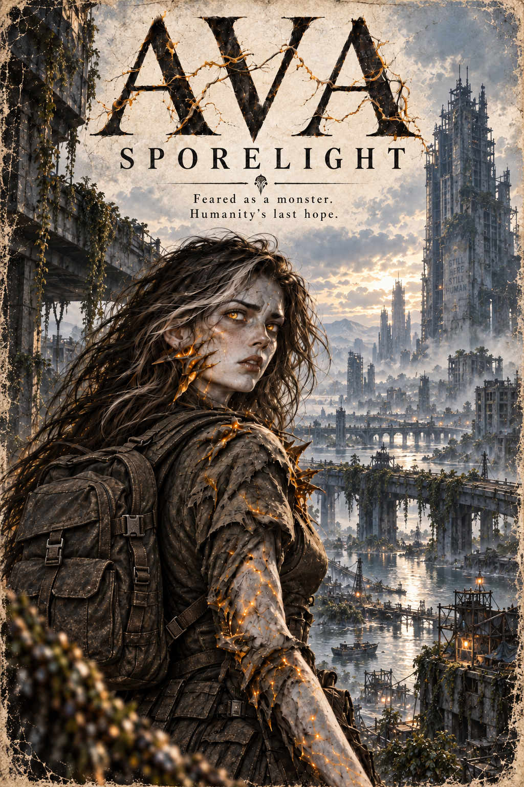

# Ava: Sporelight



This repository contains the canonical Markdown edition of *Ava: Sporelight*: a post-apocalyptic science-fiction light novel combining Ava’s origin, awakening, sanctuary, field missions, romance, betrayal, research, and future into one continuous 35-chapter story.

## Start Here

- Read the novel from [`manuscript/000-front-matter.md`](manuscript/000-front-matter.md).
- Consult authoritative story rules from [`canon/README.md`](canon/README.md).
- Continue the established voice with [`canon/08-prose-style-guide.md`](canon/08-prose-style-guide.md).
- For chapter illustrations, follow [`canon/visual/01-ava-sporelight-image-guideline.md`](canon/visual/01-ava-sporelight-image-guideline.md) and use the anchors in [`concepts/`](concepts/).
- Read contributor and agent constraints in [`AGENTS.md`](AGENTS.md).

## Repository Structure

| Path | Purpose | Authority |
| --- | --- | --- |
| `manuscript/` | The publishable novel: front matter, 35 numbered chapters, and back-cover copy. | Canonical prose, constrained by `canon/`. |
| `manuscript/images/` | Approved publishable illustrations: `000/` for cover/front-matter art, zero-padded chapter folders (`001/`–`035/`), and `shared/` for genuinely reusable assets. | Canonical presentation assets, constrained by story and visual canon. |
| `canon/` | Authoritative chronology, characters, biology, world, combat, continuity rules, and decision history. | Governs manuscript changes. |
| `canon/visual/` | Visual and production rules for depicting the novel consistently. | Governs image generation without overriding story canon. |
| `concepts/` | Character, creature, environment, and style reference images used as generation anchors. | Development references; not publishable manuscript assets or independent story canon. |

## Canon and Manuscript Relationship

Canon is a constraint system for the novel:

```text
explicit author decision
          ↓
       canon/
          ↓
     manuscript/
```

The manuscript can dramatize and elaborate canon, but it cannot silently contradict it. If an intentional story revision changes a canonical fact, update the relevant canon document and the decision ledger before or alongside the manuscript revision.

External drafts, game material, sequel plans, alternate profiles, and brainstorming ideas do not sit in this authority chain. They become canonical only when the author explicitly promotes them and the relevant canon document is updated.

## Chapter Illustration Workflow

Chapter images follow this production red line:

```text
story canon + chapter prose
            ↓
      visual guideline
            ↓
 selected concept references
            ↓
 generation and consistency review
            ↓
 manuscript/images/NNN/
```

Read the target chapter and every canon document governing what the image depicts before generation. Use only the relevant files from `concepts/` as visual anchors. Concepts may clarify appearance, palette, composition, and production style, but they cannot introduce or override story facts.

Place cover and front-matter art in `manuscript/images/000/`. Place an approved chapter-specific image in the matching zero-padded directory—for example, chapter 7 assets belong in `manuscript/images/007/`. Prefix every image filename with its two-digit order inside that manuscript page: `01-...`, `02-...`, and so on. The `01-...` image is the page cover and must be the first standalone image link; later numbered images remain inline. Reserve `manuscript/images/shared/` for assets intentionally reused across multiple manuscript sections. Link images from Markdown with paths relative to the consuming file, such as `images/007/01-example-scene.png` from a chapter.

## Novel Reading Order

| Part | Chapters | Story movement |
| --- | ---: | --- |
| I — The Last Experiment | 1–6 | Ava’s life, infection, experimentation, transformation, and cryogenic suspension. |
| II — The Rescue | 7–14 | Gabriel’s discovery of Ava, quarantine, the fortress disaster, and escape. |
| III — A Fragile Sanctuary | 15–18 | Crew mistrust, the greenhouse, combat training, partnership, and love. |
| IV — Scavengers in the Shadows | 19–32 | The hospital mission, Ava’s advancing transformation, and Harrow’s betrayal. |
| V — A New Dawn | 33–35 | Karrow’s proposal, consensual blood research, the vaccine, and a shared future. |

The narrative red line is:

**origin → rescue → belonging → fighting together → love → betrayal and discovery → chosen sacrifice → a future together**

## Current Canon Essentials

- Ava was born human and worked as a botanist before infection and forced experimentation.
- She is immune to the ordinary fatal degradation of mutation, but not to transformation itself. Her mutation continues progressing and can make her permanently monstrous.
- Her fresh blood and body fluids neutralize mutant life forms without ordinary spore release.
- Gabriel is a former firefighter and current rescue operative who becomes Ava’s partner.
- Jenna is both commander and scientist.
- EHC-17 *Haven’s Vanguard* is a terrestrial/atmospheric Titan-class hover carrier, not a spacecraft.
- Harrow the scavenger and Dr. Elias Karrow the scientist are different people.
- Ava’s consent is the ethical dividing line between the experiments that violated her and the later research she chooses.

## Editing Workflow

1. Identify the chapter or canon topic being changed.
2. Read the relevant document linked from `canon/README.md`.
3. Check `canon/07-decisions-and-continuity-ledger.md` for earlier conflict resolutions.
4. Make the smallest change that satisfies the story goal without breaking canon.
5. Update canon and its decision ledger if the author intentionally changes continuity.
6. Verify numbering, stable IDs, links, encoding, and the manuscript invariants in `AGENTS.md`.

For image work, also verify the target chapter, mutation stage, character identity, location, equipment, chronology, reference links, and final `manuscript/images/` placement against the visual guideline.

## Driftya CMS Package

Build the uploadable CMS package with Windows PowerShell:

```powershell
.\scripts\New-CmsContentPackage.ps1
```

The default output is `dist/ava-sporelight.cms-package.zip`. Use `-OutputPath` to select another destination and `-Force` to replace an existing package. Shared package settings are maintained in [`publishing/cms-collection.json`](publishing/cms-collection.json), while every manuscript page has a stable-ID-bound SEO sidecar under [`publishing/cms/pages/`](publishing/cms/README.md).

The builder validates all 35 chapter numbers and stable IDs, requires exactly one matching metadata sidecar per imported manuscript page, enforces the configured CMS field budgets, excludes `back-cover.md`, and resolves only approved files under `manuscript/images/`. External, embedded, reference-style, and raw-HTML image sources are rejected. Local image references must be contiguous and ordered by their filename prefixes (`01-`, `02-`, ...). The first image becomes `coverMedia` and is removed from packaged Markdown to prevent double rendering; later images remain inline and are emitted as ordered `relatedMedia`. The builder creates checksums for every packaged page, image, and manifest. Source images are left unchanged; package media is converted with ImageMagick to WebP at quality 96, as configured in `cms-collection.json`. Set `media.outputFormat` to `jpeg` or `original` when a different package format is required. Driftya then previews media reuse/uploads and page changes before anything is applied.

Run the focused builder tests with:

```powershell
Invoke-Pester .\tests\New-CmsContentPackage.Tests.ps1
```

## External Reference Material

The author may supply earlier drafts or reference material directly in a task prompt. Treat that material as context for the requested work, not as automatic canon. Any lasting continuity decision should be recorded in `canon/` so the repository remains self-contained.

## License

See [`LICENSE`](LICENSE) for repository licensing information. The novel’s copyright notice appears in its front matter.
