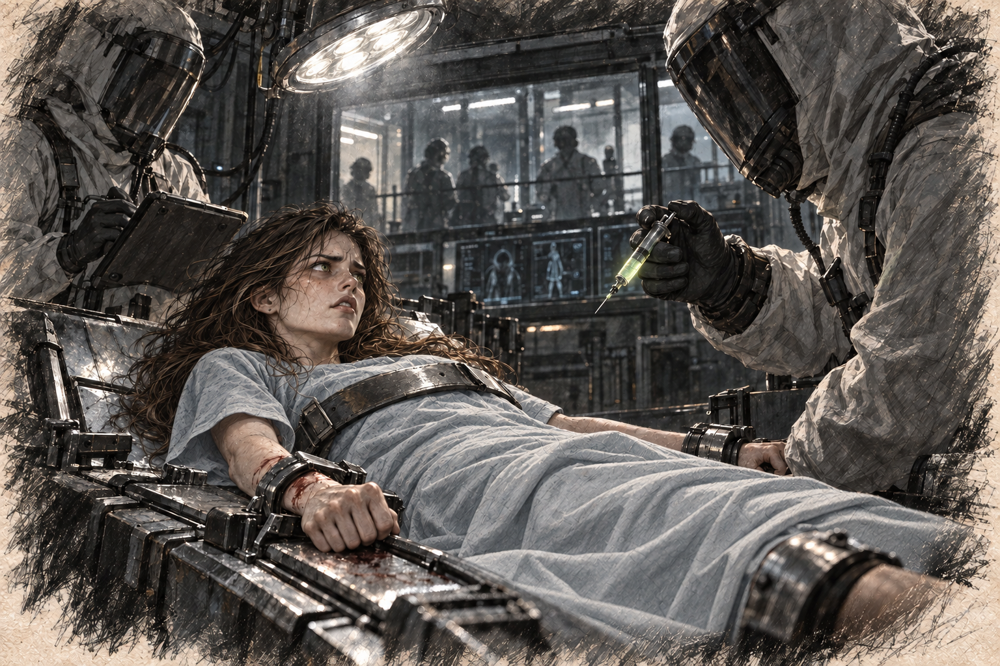

# Chapter 3: A Prison of Steel

The table was cold against Ava’s cheek. She tried to turn away from the light and found she could move her head only a little. A strap crossed her chest. Metal cuffs held her wrists and ankles.

She tested each restraint, slowly at first, then hard enough to scrape skin from her wrist. A machine beside the table began beeping faster. Beyond an observation pane, someone leaned toward a screen.

“Let me out!” she cried, her voice raw with desperation, ricocheting off the stark metal walls. “What is this? Who are you people?”

Her shout scraped her throat raw. No one answered. She remembered reaching for the hospital call button. Here there was nothing within reach except the straps.

Ava worked a thumb under the cuff. The joint would not pass. Blood slicked the metal, making it harder to grip.

She tried to make herself stop pulling. A broken thumb would be one more thing to survive. But the idea of lying still while someone watched was worse, and she pulled again, hating herself for the sound that came out.

If they let her sit up, she could explain. She knew how to handle a specimen, how to record a result, how to ask a useful question. There had to be someone here who could speak to her about what was happening. She assembled the facts of her illness as if preparing for a meeting. Her mind kept returning to the hospital bag beneath the bed. Had anyone found it? Were they looking for a missing patient, or had someone already told them she was dead?

Two people entered in full hazmat suits. Through the visors, Ava could make out a man with sharp features and a woman whose hair was pulled tight behind her head. The woman checked the number above the table against her tablet before looking at Ava.

*Keep looking at me. See me.*

“Subject is awake,” the woman said, not bothering to meet Ava’s frantic gaze. She tapped a few notes into her tablet before glancing at the man. “Vitals are stable. Shall we proceed?”

The man nodded, stepping closer to the table. He reached out, placing a heavily gloved hand on Ava’s arm, ignoring the way she flinched at his touch. “You’ve been selected for an important study,” he said, his voice devoid of emotion. “Your cooperation is… irrelevant. But your survival is critical.”

Ava’s eyes widened in shock. “What are you talking about? Let me go!”

He ignored her outburst, motioning to the woman, who handed him a syringe filled with a glowing green liquid. “Begin with regenerative stress testing,” he instructed. “We’ll need to establish her baseline before introducing the spores.”

“Spores? What spores?” Ava tried to pull her arm beneath the chest strap. “I’m already sick. What are you putting in me?”

“Administering dose,” the woman stated flatly. She stepped closer, reaching for Ava’s arm. Ava thrashed against the restraints, her muscles straining, but the straps held firm. The needle pierced her skin, and the liquid burned as it entered her bloodstream.

The burning reached her elbow, then her shoulder. Ava bit the inside of her cheek to keep from screaming and screamed anyway. Her back lifted against the chest strap; the cuffs kept her limbs flat.

“Stop! Please—please, I can’t—”

“Subject response noted,” the woman said, tapping on her tablet. “Heart rate elevated, cellular activity spiking.”

Through the haze of agony, Ava managed to spit out, “You’re killing me.”

The man leaned over her, his expression unreadable. “No,” he said coldly. “We’re learning.”

She knew that word. She had used it to explain long days, failed samples, the reason she needed to go back into the jungle. Hearing it here made her feel briefly stupid for having expected it to protect her.

Across the room the woman was still recording. Ava tried to catch her eye. She wanted her to look long enough to become ashamed. When the visor turned away, Ava found herself wishing the woman could feel even one second of the burning in her arm. The wish frightened her less than the next syringe.

When she could see clearly again, sweat had run into both ears. Someone released the cuffs. She could not lift her hands to the raw places they had left.

“Begin spore exposure in the isolation chamber,” the man instructed, stepping back. “Prepare her for the next phase.”

They wheeled her toward the door. Ava tried to memorize the turns: left past a bank of cylinders, right beneath a damaged light. The pain made her lose count.

*Again. Start again. Left. Right. Remember.*

At the next doorway, she let one bleeding hand hang over the side of the table. Perhaps it would leave a mark.
