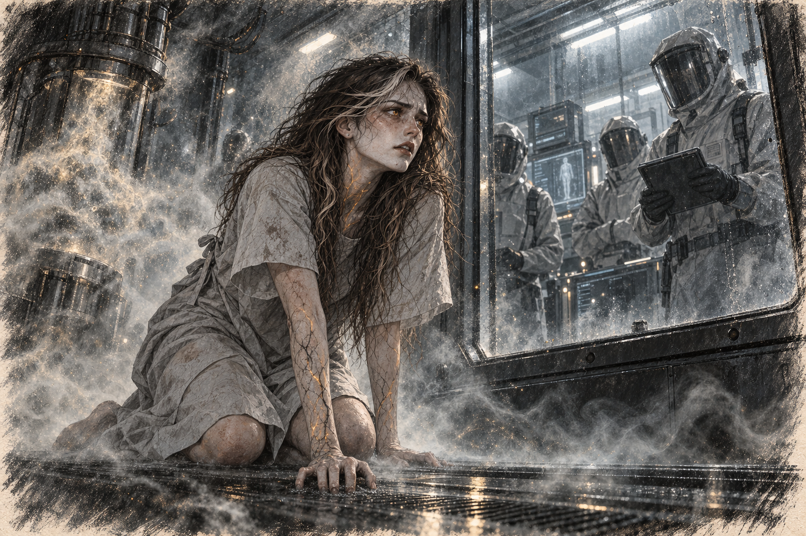

# Chapter 4: Isolation

Ava woke on her side with one arm trapped beneath her. She freed it carefully. The wrist still hurt, but the scraped skin had closed. Beyond her fingertips stood a glass wall; beyond that, another room of suited people and machines.

A technician changed a setting on a ventilator. Ava watched the gloved finger move, then looked for the vent inside her enclosure. It was above the door, out of reach.

She pushed herself upright. Someone had changed her into a thin hospital gown while she was unconscious. She pulled the open back together before approaching the glass.

The ties were too short to knot where she could reach them. She tried twice, fumbling behind her, aware of the people on the other side. None looked embarrassed. That made it worse. Her bare back was an inconvenience only to her.

She had undressed without thinking in her own room, left damp clothes over a chair, examined a scratch or a bruise because she wanted to know what had caused it. Now even turning to check her skin offered a new angle to whoever was watching. She wanted ten minutes unwitnessed. A towel. Something so small they might give it without a discussion.

She nearly asked politely. The habit disgusted her, and she pulled the gown tighter instead.

“Could I have something to cover myself?” she asked the nearest technician. When he continued entering figures, she raised her voice. “A blanket. A towel. Anything.”

He finished the line before walking away.

*Stop looking at me.*

Ava pressed her palm against the glass. “What is this? Where am I?” she demanded, her voice hoarse. “Let me out!”

No one responded. One of the figures—a woman, judging by her frame—briefly glanced at Ava before turning back to her tablet. Ava slammed her fist against the glass, but it didn’t even shudder under the force.

The intercom crackled to life, and a calm, clinical voice filled the chamber. “Subject 017, remain calm. Your elevated heart rate is being monitored.”

“Subject?” Ava spat, her anger bubbling to the surface. “I have a name. I’m a person!”

The intercom clicked off while she was still speaking.

She backed away. At the hospital the dark lines had stopped below her elbows. Now they passed beneath the gown’s sleeves. The needle marks between them were disappearing.

She traced one line with a fingertip. Heat followed its course beneath the skin.

The closing wounds should have relieved her. She had spent yesterday terrified that her body was dying. Now it was repairing itself in front of her, and she wanted the old bruises back. A bruise at least belonged to something that had happened. These lines kept travelling.

She turned her hand palm upward. The creases were still familiar. She followed the deepest one from its beginning to its end, refusing for a moment to look at anything the scientists would find interesting.

“What are you doing to me?” she whispered, her voice trembling.

The scientists outside seemed oblivious to her distress, continuing their work as if she weren’t there. One of them approached a control panel beside her chamber, their gloved hands flipping switches and adjusting dials. The hum in the room grew louder, and a faint mist began to fill the chamber.

Ava coughed, waving her hand in front of her face as the mist thickened. It smelled faintly metallic, and her lungs burned with each breath. She stumbled back, her body hitting the glass wall.

Through the haze, she saw the scientists watching her intently, their visors reflecting the dim light. The woman with the tablet leaned closer to the intercom. “Initiating spore exposure. Subject’s vitals are stable.”

“Spore exposure?” She tried holding her breath, but the cough forced her to inhale again. There was nowhere inside the enclosure the mist had not reached.

“Turn it off!” She struck the glass with both palms. “Please! I’ll do whatever you want. Just turn it off!”

The heat beneath her veins split into branching paths. Ava clawed at her sleeve. “It’s moving,” she gasped. “I can feel it moving under my skin. Please—get it out.”

She fell to her knees. Light threaded the black veins, dim at first, then bright enough to show through her sleeve. The pressure shifted beneath her skin as if something were testing where it could grow. She dug her fingers into the floor seam and screamed.

Then, as suddenly as it had begun, the pain stopped. Ava collapsed onto the floor, her body trembling. The mist began to dissipate, sucked away by unseen vents. She lay there, gasping for air, her sweat-soaked hair clinging to her face.

The intercom crackled again. “Subject 017’s resistance levels are remarkable,” the same voice said, this time with a note of fascination. “Prepare for phase two.”

Ava dragged herself back to the door. A faint current of air touched her damp face at the bottom seam. She laid her cheek against the floor and watched that narrow gap.

The next time it opened, she would have to be able to stand.

*Get up. Get up before they come back.*
