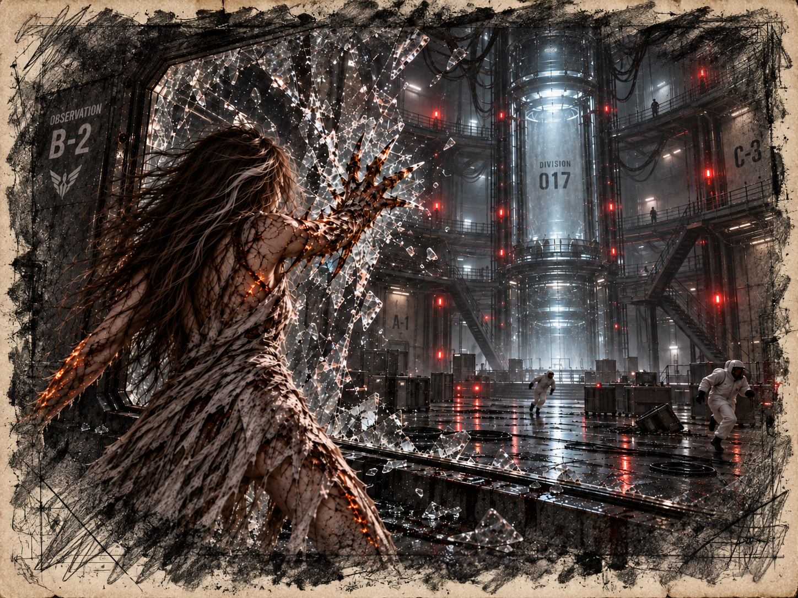

# Chapter 5: The Awakening

Ava could still feel the shape of the floor seam pressed into her cheek. She had tried to reach the door. Now she could not lift her head. The skin along her forearms tugged each time she moved her fingers, too tight for whatever was growing beneath it.

“Begin phase two,” the intercom said.

The vent opened before she could beg them to wait. Machinery shook the glass around her. Mist rolled across the floor and entered her mouth with the first cough. She tried pulling the gown over her nose; the thin cloth grew damp against her lips.

Heat drove her upright. She clutched her arms, trying to keep the swelling still. Through the mist, the woman with the tablet moved closer to the glass. Ava could see her own bent reflection in the visor.

The pain reached an unbearable crescendo. Ava’s frame twisted uncontrollably, her back arching as her veins glowed an eerie amber. Her eyes burned. In the glass, the green of her irises disappeared beneath amber light. Something deep within her snapped, and a guttural scream escaped her lips as her body transformed.

Hard plates formed beneath her skin. When she struck the wall, a spike tore out along her forearm and punched through the glass. Cracks spread from it. She struck again. The wall broke, and her next wild swing caught the suits of the scientists crowding the breach. Vials shattered beneath the falling glass.

For an instant she felt glad. The glass had moved. The people beyond it were finally moving too, backing away from her instead of deciding how close to come.

Then someone fell under her arm, and the relief had nowhere to go. She tried to open her hand. The new weight at her wrist pulled it sideways. She could not tell where her fingers ended in the blood.

*Stop.*

Her body struck again.

*STOP.*

The nearest monitor broke under her hand. Red alarm light swept over people slipping in the mist. Guards pushed through the doorway and fired. A man whose neck had already swollen against his collar burst apart at the shoulder; spores billowed from the damaged tissue. Ava flinched from the gunshot and drove an arm through the console beside him.

“Get away from me!” Ava tried to retreat and her altered heel crushed a hand reaching across the floor. The scream beneath her did not sound like any of the people who had watched her through glass. It sounded human. She lifted her foot too late.

A spike drove through a guard’s abdomen and caught beneath his ribs. Ava felt the resistance in her shoulder, then the wet release as her arm tore free. She tried to drop the weapon and found it was part of her.

Amber plates along her back tore through the gown. Another spike punched a second visor; the man behind it went down clutching a face that was no longer a face. Someone screamed and did not finish the sound. Ava’s next swing opened a suit from collarbone to hip. Blood and ichor ran together down the spike, dripping onto the floor she could not keep her feet from crushing.

“I can’t stop!” The words broke beneath another roar. Her body chose the nearest movement and completed it with terrible strength. “Please—run!”

Those who could still move were already running. Her breaths came in ragged gasps, each exhalation fogging the blood-slick faceplate of a scientist trapped against the console.

One of the scientists, a middle-aged man clutching his side where blood seeped through a tear in his suit, crawled toward a console. His trembling hand reached for a syringe loaded with a potent tranquilizer. With what little strength he had left, he lunged toward Ava as she loomed above him, her spikes dripping with blood and ichor. With a desperate cry, he drove the syringe into her neck, pressing the plunger.

Ava roared, her body convulsing as the tranquilizer took hold. Her vision blurred, the searing heat of her transformation ebbing as her spikes slowly retracted. The glow in her veins flickered and dimmed, leaving her weak and disoriented. She collapsed to her knees, her amber eyes filled with exhaustion and the fading remnants of resistance.

The scientist crawled toward a pod built into the wall. He dragged one leg behind him and left a smear of blood at every push. Ava tried to move in the other direction. Her hand slid on the floor.

“You have to survive,” he rasped.

“I killed them.” Ava could barely hear herself beneath the alarms. “I told them to run.”

He activated the pod, then caught her beneath the arms. She could still feel his gloves as he hauled her inside, but she could not make him stop.

She wanted the jungle with an urgency that hurt more than the dragging. Mud against her knee. An insect she could slap away. Air she could choose to breathe. She tried to remember the path back to the bench, but every turn became another white corridor.

The man was speaking again. She could not understand him. It frightened her that understanding had become an effort, that a voice could reach her and fail to become words. She fixed on the one she had carried into every room: Ava. She would tell him. She would keep telling him until he answered to it.

The lid closed. Cold spread from the surface beneath her back. On the other side of the glass, the scientist slumped out of sight. Ava tried to say her name. Frost gathered before her mouth.

“Ava,” she managed. “My name is Ava.”

The alarms kept sounding after she could no longer see the room. Then the cold took those too.
