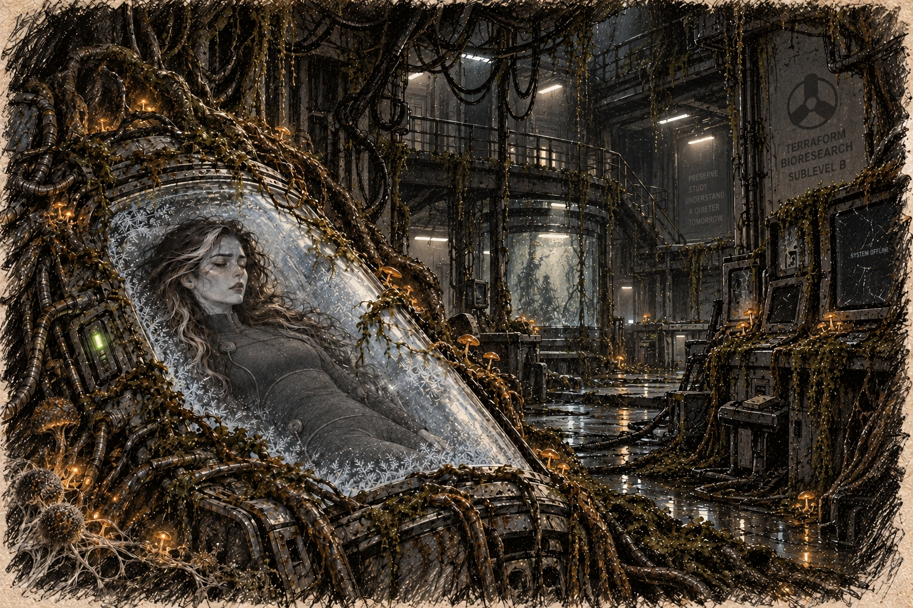

# Chapter 6: The World Beyond

Spores escaped through the laboratory’s broken vents and settled on the wet jungle floor. Rain carried them into drainage channels. Birds moved through the contaminated canopy and flew beyond it. Within days, leaves around the facility had begun to darken.

Some plants grew faster than their stems could support. Branches split beneath unfamiliar weight. Animals stopped feeding or turned on others of their own kind. Birds carried contamination in their feathers to farms the laboratory’s staff had never visited.

News of the incident broke a week later, though the true scope of the disaster remained obscured by government secrecy. Officials assured the public that the situation was contained, that there was no cause for alarm. But whispers of something far worse began to spread—rumors of a sickness that turned people into monsters, of spores that rendered entire towns uninhabitable.

In the cities, fear festered. People wore masks, avoided crowds, and stocked up on supplies. The air of unease grew heavier with each passing day as more stories leaked of strange occurrences in rural areas—farms where livestock had become unrecognizable, forests where the trees themselves seemed to pulse with life. Scientists who dared to speak out were silenced, their warnings dismissed as paranoia.

“Remain indoors. This is a temporary containment measure,” emergency broadcasts repeated while families hammered cloth around their windows. In one street, a woman stood before a closing barrier and screamed, “My son is still in there.” The guards held the line. Nobody on either side believed the word *temporary*.

Beneath the surface of the chaos, there were those who saw opportunity. Governments and corporations alike scrambled to study the spores, hoping to weaponize their transformative properties. In secret laboratories across the globe, experiments mirrored those conducted on Ava, each one inching closer to catastrophe.

Under the fallen laboratory, Ava’s cryopod kept running. Soil washed into the passage outside. Roots entered the cracks in the ceiling. The frost on the lid concealed her from everything that came after.

Over two centuries, roads disappeared beneath growth and settlements formed around whatever shelter remained. Humanity retreated toward the cold, where spores spread more slowly. Rescue crews learned to travel between those refuges and the people stranded beyond them. Filters, fuel, and an open route home mattered more than the number of creatures a squad could kill.

The first evacuees carried keys. Even when a road closed, even when the house behind them could no longer be seen through the growth, they kept a small piece of metal in a pocket. Later generations carried spare filter seals, sewing needles, the part a mechanic had said could not be made again. Children learned which possessions to fetch at an alarm and which to leave.

“Why bring that?” a child asked when his father fastened a useless brass key around his neck.

“Because it’s ours,” the man said. Years later the child would remember the answer more clearly than the door.

In the cold settlements, growing rooms became as necessary as walls. People queued outside them with empty containers, breathing the damp warmth whenever a door opened. A failed lamp could mean a missed harvest. A mechanic keeping it alive through the winter might never learn the name of the botanist who had once catalogued the plant beneath it.

Ava’s working world vanished unevenly. Words for plants survived in books after the plants disappeared from the places described. The useful measurements were copied; the names at the top of a page sometimes were not. Two hundred years held enough ordinary mornings for a whole life to be lived and forgotten more than once. None reached the woman beneath the frost.

Gabriel’s squad worked two hundred years after the breach. They ferried survivors north in repaired transports, sometimes returning for people they had lacked room to carry on the first trip. Masks passed from gloved hands to smaller hands. At each departure, someone counted the empty seats.

Forests shone at night. In abandoned streets, living growth pulled buildings apart from within. Elsewhere, people mended roofs, raised children, and marked the routes where a rescue vehicle had last got through.

Beneath the old facility, the pod’s status light remained green.
