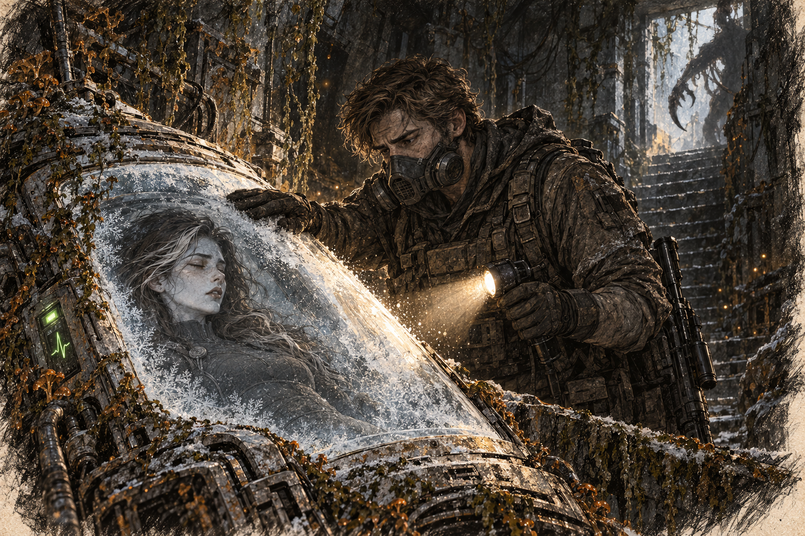

# Chapter 7: The Cold Horizon

Damp had reached the padding inside Gabriel’s filter mask. He pressed its seal against his cheek and checked the detector on his chest before surveying the town square. Vines buried the benches and climbed the evacuation markers. He turned up the radio over the rasp of his breathing.

“Bravo team, report. Any movement?”

Gabriel pressed the button on his chest rig. “All quiet for now, Captain. Citizens are almost loaded into transport. ETA five minutes.”

“Good. Keep it that way.”

He stepped back to cover the street while the last civilians boarded. A shape stirred beneath the vines on the far side of the square. He kept his rifle low. No shot unless it came for them.

At the ramp, a woman was trying to bring a planting box aboard. Someone had told her there was no space for the soil. She held it against her coat while a crew member waited with an empty sack for the roots. Gabriel watched her loosen her grip one finger at a time.

He knew that delay. People who had followed every order could stop at a doorway over an object that looked worthless. He had once argued for a whole minute about a man’s broken kettle before learning it had belonged to his wife. Since then he tried to leave room for an explanation, though some days there was no room and no minute.

The woman tipped the soil out beside the ramp and gathered the plants into the sack herself. Gabriel looked back toward the vines. He could do his job better if he stopped watching her.

“Gabe!” a voice called. Jenna, commanding the evacuation on the ground, waved him over. “We’ve got another group lagging behind. Block A, building four.”

“Great,” he muttered under his breath. “Just what we needed.”

He jogged toward the building, his boots crunching against the frosted ground. Temperatures had dipped as they moved north, but it wasn’t enough to stop the spread. The colder settlements offered better odds, and even those were filling fast with refugees.

The building stood over the remains of an older underground structure. A broken floor exposed steel-lined walls beneath the settlement’s masonry. Gabriel swept his light over the stairwell and listened. He had been sent for a group; he could hear no voices.

At the bottom of the stairs, Gabriel pushed the door open, the hinges groaning in protest. Inside, the air was musty and still. He swept his flashlight across the room and froze.

A cryopod stood among collapsed equipment racks. Rust covered its lower housing, but a green status light still blinked beneath the dust. Gabriel moved a fallen cable out of the way to read it.

“Jenna, you seeing this?” he called over the radio.

“Hold on—what are you talking about?”

“There’s… a pod here. Looks operational.”

He wiped the lid with his glove. A woman lay inside, dark hair spread around her head, silver strands caught against the lining. Her face looked no older than his. He pressed his light nearer the glass, looking for any sign that the status light was telling the truth.

*Please be alive.*

“Gabe, what’s the hold-up?” Jenna’s voice crackled.

“We’ve got a survivor,” he said. “Cold sleep. I don’t know how long.” He checked the life-sign display against the woman behind the frost. The trace moved.

He could hear Jenna cursing faintly on the other end. “Can you move her?”

“Pod looks portable, but I’ll need backup. This thing’s heavy.”

Before Jenna could respond, something scraped down the stairwell he had just used.

Gabriel turned his light toward the door. A claw hooked around the frame.
