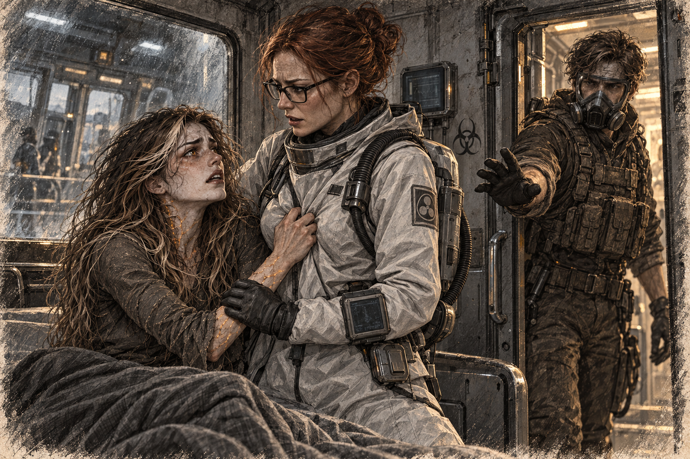

# Chapter 10: Breaking Barriers

Gabriel sat just inside the quarantine chamber with his hands on his knees. Ava watched him from the far corner. The ridges along her face had receded, but she kept one palm pressed over her forearm.

Equipment rattled behind the observation glass. He waited until Ava stopped looking toward it.

“You don’t have to talk,” he said. “I thought you might want to know where you are.”

Ava didn’t respond, but she didn’t look away either. It was enough for Gabriel to continue.

“You’re in one of our rescue transports,” Gabriel said. “We’re heading north to a fortress checkpoint. If they clear us there, our base is a carrier called *Haven’s Vanguard*.”

“Clear us?”

He glanced at the reinforced glass between them and the observation room. “Quarantine. The rules are strict because they have to be.”

Ava pulled her knees closer.

“The cold slows the spores,” he continued. “It doesn’t kill them, but the northern settlements last longer. That’s where we take people.”

“And the things outside?”

“We avoid them. Killing one can release enough spores to contaminate the whole route.” Gabriel rubbed the repair patch over his bandaged arm. “That’s why what you did matters. Your blood stopped it, and the detector never moved.”

He paused, choosing the next truth with care. “A meteor brought the organism to Earth roughly two hundred years ago. Plants changed first. Then animals. Then us. Some people die during mutation. Some lose themselves. No one I know survives it the way you have.”

Ava stared at him. “No. Say a different number.”

Gabriel’s face tightened. “I wish I could.”

“Two hundred years?” Her voice climbed with every word. “Everyone I knew—everyone who might know me—” She pressed a fist to her mouth, then forced it down. “They’re dead.”

“Nobody from your life could still be waiting,” Gabriel said.

“I didn’t ask them to wait.” Ava struck the floor once with the heel of her hand. “I was supposed to come back.”

Ava’s fingers tightened around her knees. Her voice was barely above a whisper when she finally spoke. “Am I… one of them?”

Gabriel hesitated. He wasn’t sure how to answer. “You’re… different,” he said carefully. “But you’re not like them. Not completely.”

She looked away, her expression unreadable.

“I mean it,” Gabriel added, his voice firm. “Back in the broken city, when that thing attacked me… you saved me. You saved all of us. If it weren’t for you, we wouldn’t be here right now.”

Ava’s head turned slightly, her eyes meeting his. There was doubt in her gaze, but also a glimmer of something else—hope, maybe.

“I don’t remember much,” she admitted, her voice trembling. “I was sick. Dying. Then… I woke up here.”

“You told me that outside,” Gabriel said. “About being sick. If you remember anything else, I’ll listen.”

Ava studied him for a long moment, her guarded expression softening ever so slightly.

Over the next few days, their conversations grew longer. Gabriel kept his distance at first, sitting near the door while Ava stayed in her corner. He told her stories about his life before joining the rescue crews—his time as a firefighter, the small town he grew up in, and the parents he had lost to the life forms.

“They were good people,” he said one evening, his voice heavy with emotion. “They deserved better than what happened to them.”

Ava listened quietly, her head tilted slightly to the side. “You miss them.”

“Every day,” Gabriel admitted. He looked at her, his expression softening. “But I think… I think they’d be proud of what I’m doing now. Of helping people.”

Ava’s gaze dropped to the floor. “I don’t even know if I have parents.”

“You had a life before this,” Gabriel said. “You don’t have to remember all of it today.”

She didn’t respond, but the corners of her mouth twitched ever so slightly, as if she were considering a smile, or perhaps just the weight of his words.

By the time they were a few days away from the checkpoint, the distance between them had shrunk. Gabriel now sat a few feet away from Ava, close enough to see the faint shimmer of her skin in the dim light.

One evening, as they talked, Ava laughed softly at something he said. It was a quiet, almost shy sound, but it lit up her face in a way that took Gabriel by surprise.

“That’s the first time I’ve heard you laugh,” he remarked, his smile growing as he watched the warmth flicker in her eyes.

Ava hesitated, then gave him a small, tentative smile in return.

Gabriel felt his breath catch. Her features, even with their faint alien ridges, were strikingly beautiful. Her amber eyes glowed softly, framed by delicate strands of silver-threaded hair.

“You’re amazing,” he said before he could stop himself.

Ava’s smile faded slightly, and she looked away. “I’m not. I’m… a freak.”

“No,” Gabriel said firmly. He reached out instinctively, stopping himself just before his fingers brushed against her hand. He hesitated, watching her carefully—the way she avoided his gaze, the tension in her shoulders, the doubt shadowing her expression.

Gabriel left his hand on the floor between them. He had been about to tell her what her blood might mean for everyone else. Looking at her now, he heard how close that would sound to Jenna asking for tests.

“You saved my life,” he said. “You’re allowed to be frightened about how.”

Ava studied the space between their hands. She moved hers a little closer, leaving a finger’s width of metal between them.

He thought of the checkpoint waiting at the end of the journey. A report could turn her into an asset before anyone there had heard her speak.

“They’ll never understand you,” he said quietly, almost to himself.

Ava tilted her head. “Who?”

“People,” Gabriel said, his voice heavy. “If they find out what you can do, what you are… they’ll be afraid. And when people are afraid, they do terrible things.”

Ava’s smile faded, and she hugged her knees to her chest. “I don’t want to hurt anyone.”

“I know,” Gabriel said. He moved closer, sitting beside her. “And I’ll do everything I can to make sure no one hurts you either.”

Ava leaned against him, her head resting lightly on his shoulder. Gabriel stayed still. When the transport banked, he braced one hand on the floor so she would not slide.

***

After he left, Ava sat where his shoulder had been. The floor was warmer there, or she imagined it was. She kept her hand on the place until the warmth became impossible to distinguish.

Two hundred years. She had heard the number when he said it. She had even nodded. Only now, without his voice giving her the next thing to listen to, did she try to live inside it.

She had been waiting to remember enough to tell them where to take her. There would be a name, a road, someone who would answer when they called. She could endure another journey if it ended there. But Gabriel had spoken of the meteor as something older than his family. Wherever she came from, it had gone on without her until there could be nobody left to ask.

She tried to summon a face. Instead she remembered the feeling of being expected: having to explain why she was late, resenting the question because she had been working. Who had asked? The memory would not turn toward her. She pressed the heels of her hands into her eyes, angry that she could remember the irritation and not the person she owed it to.

There were people beyond the wall, eating and arguing about a loose fastening. One laughed. Ava wanted them to stop. For a moment she hated them for continuing so easily, then hated herself because their world had been ruined too.

She lay down facing the door. Tomorrow Gabriel would come back. She wanted that so badly it frightened her. There was already one part of the day she could lose.

*Come back tomorrow. Please.*
