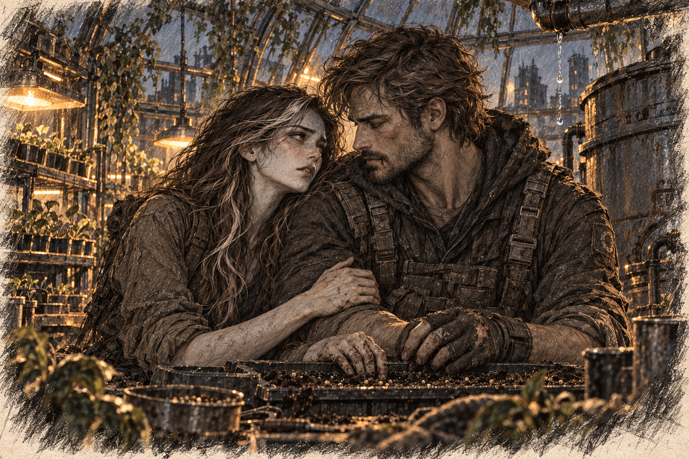

# Chapter 17: The Price of Survival

Gabriel stopped at the corner of the grocery store and checked the detector. His mask had begun to chafe beneath his chin. Across the street, branches grew through the windows of a house, lifting its roof a little farther from the walls. He signalled the team to follow him inside.

They found sealed supplies in the rear stockroom. Most of the food had spoiled; Gabriel left cans swollen at the seams on the shelf. The team packed what they could use and cleared a path back to the vehicle.

But as they prepared to leave, a sound stopped them in their tracks—a guttural clicking noise that sent shivers down their spines.

“Move! Back to the vehicle!” Gabriel ordered, his voice muffled through the mask.

The team scrambled, but the clicking grew louder, and a mutated life form burst from the shadows. Its elongated limbs and sharp, crystalline growths glinted in the dim light. It moved with terrifying speed, lunging toward one of the survivors.

Gabriel fired his weapon, aiming for distraction rather than a kill to avoid spore release. The creature snarled and turned its attention to him. Gabriel backed away, drawing it further from the group.

In the chaos, a survivor tripped, and the creature lunged. Gabriel didn’t hesitate—he threw himself between the monster and the fallen man, taking a sharp blow to his side as he shoved the other to safety.

The team managed to escape, but at a cost. Two survivors had been lost, and Gabriel was bleeding heavily from a deep gash on his torso.

***

Back on the ship, Ava dropped the tray she was carrying when she saw him stagger through the airlock, his arm slung over another survivor’s shoulder. Blood stained his shirt, and his steps were unsteady.

“Gabriel!” she cried, rushing to his side.

“No, no, no.” She caught his free hand. “Look at me. Gabe, look at me.”

“I’m fine,” he said weakly, though the pain in his voice betrayed him.

“Don’t lie to me,” she whispered, helping him to the medical bay.

Jenna cut away the ruined shirt and cleaned the wound while Ava stood beside the examination table.

“No signs of infection so far,” Jenna said. “We keep checking.”

The dressing reddened before she had finished fastening it. Ava watched Gabriel try to hide a flinch.

*I was thinking about kissing you.*

While he was bleeding somewhere beyond the carrier, she had been deciding whether to let her hand stay against his the next time they worked together. The thought had hurt nobody. It felt obscene anyway.

“Two didn’t come back,” he said when Jenna turned to the tray.

Ava looked at the dressing again. She could not summon those two people properly. Her relief that he was here took up too much room. She would learn their names, she decided, and listen when the crew spoke of them. For now she moved the water within his reach because it was something she could do without pretending to feel better than she did.

She couldn’t stand by any longer.

That evening, as Gabriel rested, Ava approached Jenna. “I want to help with the scavenging missions.”

Jenna frowned. “Ava, you’re already doing so much here. You don’t have to—”

“I want to,” Ava interrupted, her voice firm. “I can’t keep waiting for him to come back hurt—or worse. You’ve seen what I can do to them. Teach me to do it without losing control.”

Jenna studied her for a long moment before nodding. “I’ll talk to Gabriel. But you know he’s going to argue.”

“He can argue all he wants,” Ava said quietly. “I’m not changing my mind.”

Gabriel wasn’t happy when he found out, but after hours of heated discussions, he reluctantly agreed. “If you’re going out there, I’m going with you,” he insisted.

“I’m asking you to teach me,” she said. “I’m not asking you to become impossible to kill.”

He looked away. She had meant to win the argument and hated the wound she found instead. For a while they listened to the medical bay’s ventilation.

“You can be angry,” she said. “I was.”

“Was?”

She almost smiled. “Am.”

***

Before she could join the next operation, Ava needed to be prepared. Gabriel made sure of that.

Once he could stand through a session without bleeding through the dressing, they began. Over the following weeks, he worked through the same drills with her, starting with the basics—how to handle a weapon, where to strike to incapacitate rather than kill, how to anticipate enemy movements. Though Ava had instinctive strength and speed, combat was more than raw power. It was about control, about knowing when to hold back and when to strike.

“Don’t just rely on your strength,” Gabriel told her, stepping back after demonstrating a proper defensive stance. “It’s an advantage, sure, but without control, it’s just another liability.”

Ava wiped the sweat from her brow and adjusted her stance, her fingers curling into fists. She wasn’t used to fighting this way—structured, calculated. She had always reacted, letting instinct take over, but now she had to think. Gabriel made her repeat each move until it felt natural, until her footwork was precise and her strikes landed with intent rather than blind aggression.

The training wasn’t just physical. Gabriel also taught her about the dangers of the field—how mutations behaved, the best ways to avoid unnecessary fights, and the importance of staying calm under pressure.

“If you panic, you make mistakes,” he said, handing her the practice knife hilt first. Her fingers slipped on the grip, slick with sweat. “And out there? One mistake can get you—or someone else—killed.”

Ava swallowed, gripping the knife tighter. She understood that better than anyone.

Her first mission didn’t go as planned.

The team was sent on a small supply run to a derelict convenience store on the outskirts of a ruined city. It was supposed to be an easy job—go in, grab what they could carry, and get out before attracting attention.

But when a group of twisted, skeletal mutations emerged from the shadows, Ava hesitated. The way they moved, their gnarled limbs twitching unnaturally, sent ice through her veins. Gabriel fired at a hanging sign beyond the creatures. Metal crashed onto the pavement, turning two toward the noise while the team moved for the vehicle.

Ava stood frozen, breath hitching as memories clawed at the edges of her mind. The lab. The restraints. The sterile voices discussing her like she was an object. The burning pain of her mutation overtaking her body.

One of the creatures lunged at her. She barely moved in time, stumbling backward as it swiped at her, claws grazing her arm. Her blood sizzled where it touched, the creature shrieking as it recoiled. The noise jolted her back to reality.

“Ava! Move!” Gabriel’s voice cut through her haze.

*Move.*

She tried. She swung at the creature, but her movements were sloppy, panicked. It wasn’t like training—it was chaotic, messy, real.

She almost lost control.

The fear surged too quickly, her heart hammering as her body tensed, the glow in her veins intensifying. Her mutation threatened to take over, to consume the fear with violence. She could feel it creeping up, the familiar sensation of something monstrous clawing beneath her skin.

Gabriel backed toward the vehicle, keeping himself between Ava and the creatures still at the sign.

“Ava. Three steps back.” He showed her the gap beside the vehicle. “Then turn. I’ll cover you.”

She counted the steps. On the second her heel struck rubble and the pressure beneath her skin surged again. She corrected her footing, found the door handle, and held it until she could feel its shape. The glow began to recede.

Gabriel got in beside her and called for the driver to move before the creatures at the sign turned back.

They survived that mission, but Ava couldn’t forget how close she had come to losing herself.

Still, she refused to quit.

That did not mean she wanted the next mission. In the training space, where nothing screamed back, she could want it very convincingly. At the airlock she sometimes wished for a fault in the vehicle, a delay nobody could blame on her.

After the failed run, she wrote the retreat down before she wrote the attack: three steps, rubble under her heel, the handle. She had been able to count. The entry looked pitiful beside the pages of drills. She kept it because it was the part she had actually managed when it mattered.

Gabriel didn’t give up on her either. After each mission, he reviewed what went wrong and how to improve. She worked harder, learning to anticipate her fear instead of running from it. She learned how to fight with control, how to channel her power without letting it consume her.

On the next rescue assignment, she checked the route herself before Gabriel asked.

***

They set out with a smaller team, this time heading to a makeshift settlement built within the ruins of an old factory. The survivors there had done their best to fortify the area with scrap metal and barbed wire, but their resources were dwindling, and their defenses weren’t enough to keep the mutations at bay.

Ava had been on missions before, but this was different. This time, she felt ready.

A woman patched the factory gate with wire while two children passed her the pieces. Neither child looked up when the team arrived. The older one wore a filter mask repaired with cloth tape; Ava could see the edge lifting each time he breathed.

Ava pointed out the loose seal to Gabriel. He took a spare mask from his pack and crouched beside the child.

They were talking to the settlement’s leader when the wall beside the gate buckled. A many-limbed creature forced its bulk through the sheet metal, jaws working around a torn strip of it. The children dropped the wire. Gabriel pushed them behind him; a claw opened his eyebrow before he could duck. Blood ran into one eye.

Ava froze for only a second—then she saw Gabriel among the chaos, trying to help the others. Fear threatened to take hold, but this time, she pushed past it.

*Not him. Not again.*

Heat spread into her hands. She was afraid, and the mutation answered. Ava planted her feet as Gabriel had taught her, then moved before the pressure could choose a shape of its own.

She charged at the creature, dodging its massive claws. The fight was brutal—every punch and kick she landed felt like hitting solid steel, and the creature’s strikes left her bruised and battered. But she refused to back down.

It lunged, knocking her to the ground, its maw snapping inches from her face. Her heart pounded, and for a terrifying moment, she felt that old fear creeping in.

“The child’s clear!” Gabriel shouted. “Room on your left!”

Ava rolled into the space he had called. A claw scraped her knuckles as she got her feet beneath her. She caught the damaged edge of a metal panel and tore her palm open against it. The pain made her stomach turn.

When the creature lunged again, she drove her bleeding hand beneath its breastbone. The tissue gave around her fingers. Its weight carried her down, but the legs had already begun to fold. She crawled out as the body collapsed without a spore burst.

Ava stumbled back, breathing hard. The settlement was silent, everyone staring at her. Some with awe, others with fear.

Gabriel crouched in front of her with gauze in his hand. Blood had dried in his eyebrow and along the edge of his mask.

“Ava. Let me see.”

She opened her fingers. He put the gauze over her palm, and she pressed it down herself. The sting kept her attention on the wound while the last of the amber light faded.

“You stayed with me,” he said.

“I heard where to move.” She looked toward the gap in the wall. “That helped.”

“Then we practice that.”

He wanted to say something else. She could see him looking at the soaked dressing.

She wanted him to be proud of her. She wanted to hide the hand behind her back so he could be proud without that look. The two impulses belonged to the same exhausted minute, and neither made the wound hurt less.

“Don’t,” she said. “I know what it cost.”

He nodded and helped her stand. The older child was waiting beside the gate with the spare mask held against his face. Ava showed him how to tighten the strap with her uninjured hand.

By the time they returned to the ship, they had recruited a few survivors from the settlement—people willing to work and help rebuild. The atmosphere on the ship was tense but hopeful.

That night, Ava sat between the greenhouse beds, keeping her bandaged hand clear of the soil. Gabriel came in carrying a chair but left it beside her and sat on the floor instead. He had cleaned the blood from his face. The cut above his eye pulled each time he frowned.

When he finally spoke, his voice was quiet but firm. “You were brave today.”

Ava stopped picking at the edge of her gauze. “You said I stayed with you.”

“I wanted to say it where nothing was trying to kill us.”

That made her smile, briefly.

Ava let out a slow breath, flexing her hands, wincing slightly as the cuts across her knuckles pulled tight. “It didn’t feel brave,” she admitted, her voice quieter now. “It felt like I was drowning, like I had to fight just to stay above the surface.”

Gabriel’s jaw tightened. “That’s what makes it brave.”

He reached for the empty planting tray by her knee. “What needs doing?”

She turned back to the plants, running her fingers gently over the tiny leaves, grounding herself in the sensation. “They’re going to need more space soon,” she murmured, shifting the subject before her emotions could get the better of her. “Stronger roots.”

Gabriel turned the tray over to check the drainage holes. “I can find a deeper one.”

Ava let her shoulder rest against his while he worked a clogged hole clear. The cut on her hand still hurt. She stayed until he had finished.
