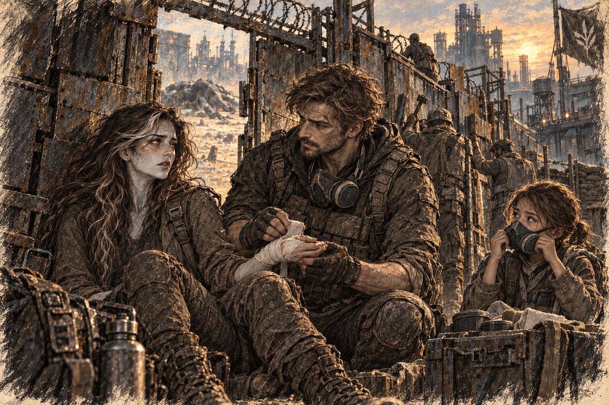

# Chapter 18: A Fragile Confession

Three nights after the factory settlement, Ava found Gabriel repairing a greenhouse trellis he had no business touching.

“That isn’t broken,” she said.

He looked at the copper joint between his fingers. “It was loose.”

“It moves because the carrier moves.”

“Poor design.”

“You built it.”

Gabriel set down the wrench.

The cut above his eyebrow had sealed into a dark line. Ava had watched a mutant’s claw open that same skin. She had watched him stand between the creature and a child after the blood had already blinded one eye. In the days since, every ordinary sight of him—eating, arguing with Cora, sleeping through half a briefing—had carried the unbearable knowledge that it could have been absent.

She returned to pinching dead leaves from a tomato plant. “You’re avoiding something.”

“So are you.”

“I’m working.”

“At midnight.”

“Plants don’t respect shifts.”

He came to the other side of the table. Between them stood six tomato seedlings, a tray of surgical clamps repurposed as plant ties, and everything they had not said beneath the leaking water tank weeks ago.

“When that thing came through the factory wall,” Gabriel said, “I thought I was going to die.”

Ava’s fingers closed around a dead leaf.

“I wasn’t thinking about the settlement. Or the carrier. I was angry because I hadn’t told you.”

“Told me what?”

He laughed once, without humor. “I had a better version of this speech on the walk here.”

“Was it very heroic?”

“Embarrassingly.”

“Then this version is already better.”

Gabriel came around the table. He stopped an arm’s length away, close enough for her to see where exhaustion had bruised the skin beneath his eyes.

“I love you,” he said. “I don’t know when it stopped being gratitude or responsibility or me refusing to leave one more person behind. I only know it did.”

The leaf went still between Ava’s fingers.

*Say it again.*

She looked at his mouth. He had said it. There was no other way to hear those words, no kind misunderstanding to hide inside.

“Ava?”

“I heard you.” It came out almost sharply. “I just—”

*I want this. God, I want this.*

“You’ve seen what happens to me.”

“Yes.”

“It’s getting worse.”

“I know.”

“I might not come back one day.”

Gabriel did not cover the fear in his face. “I know that too.”

The dead leaf broke inside her fist. “And you still—”

“Yes.”

She opened her hand. The crushed leaf left its sharp green smell on her skin.

“I love you,” she said. Her voice did not sound transformed or ancient or dangerous. It sounded small and entirely hers. “I have for longer than I wanted to admit.”

Gabriel reached toward her face and stopped. “Can I kiss you?”

“You took long enough to ask.”

His first attempt caught the corner of her mouth because she was smiling. The second did not.

His hand settled at the back of her neck. Ava forgot the answer she had prepared for this, the little joke that would keep her from seeming too eager. Heat spread low through her belly. She shifted toward him, then closer still, impatient with the space his carefulness left between them.

*Again. Kiss me again.*

“Don’t go yet,” she said when he drew back for air.

“I’m right here.” His voice was rougher than she knew it.

She laughed against his mouth. “I know.”

His next kiss was still careful. Ava caught the front of his shirt and pulled him closer until the table pressed into her hip. Soil spilled from a pot behind them. Neither looked.

When they separated, Gabriel rested his forehead against hers.

“I’m still injured,” he said.

“I noticed.”

“That sounded less threatening in my head.”

She kissed the uncut side of his mouth. “Your quarters.”

He searched her face. “Are you sure?”

“I want to be somewhere the tomatoes aren’t watching.”

The walk there was short and excruciatingly public. They passed Malik, who looked at Gabriel’s eyebrow, looked at their joined hands, and developed a sudden interest in the opposite wall.

Inside Gabriel’s quarters, certainty became harder.

The room contained a narrow bed, a rescue coat hooked beside the door, and a stack of manuals under one leg of a crooked desk. Ava had imagined something more revealing. Perhaps this was: he owned almost nothing he could not abandon during an alarm.

Gabriel removed his shirt and winced when the fabric pulled at the bruising along his ribs. Ava touched the yellow edge of the injury.

She knew his body through damage before she knew it through anything else. Dressings, torn sleeves, the places he guarded when he stood. Now she let herself look at the unhurt parts too: the slope of his shoulder, a pale patch where clothing usually covered him, the uncertain smile he gave when he caught her staring.

“What?” he asked.

“Nothing.” She stopped herself. “I like looking at you.”

He smiled, and she had to look away. The warmth he had started in the greenhouse had become a low, insistent ache. She pressed her thighs together, abruptly aware of how badly she wanted his next touch.

*He can see it. Let him.*

“Tell me if I hurt you.”

“Same rule for you.”

She nodded, but her hands had begun to shake.

He noticed. “We can stop.”

“I don’t want to stop.” Ava sat on the bed and made herself say the more difficult part. “I need us to go slowly.”

“Then slowly.”

He knelt to remove her boots. The second buckle refused him.

“You can dismantle a barricade,” Ava said. “It’s a boot, Gabriel.”

“Your encouragement is invaluable.”

When it finally came loose, she caught his face between her hands and kissed him before he could make a speech about it.

They undressed without grace. Her shirt caught in her hair. Gabriel’s belt struck the floor louder than expected, and they both froze, listening for footsteps in the corridor. None came.

When he saw her fully, his attention stopped at the scars the laboratory had left: pale lines at her wrists, puncture marks along her inner arms, a thicker seam below her ribs where something had once been inserted or removed.

Ava almost covered herself.

“Don’t look at me like I survived something beautiful,” she said.

“I wasn’t.” Gabriel touched the scar below her ribs only after she guided his hand there. “I was thinking I hate whoever did this.”

“Good.”

She drew him up and kissed him again.

“You keep stopping just before you touch me,” she whispered.

His hand rested at her waist. “I don’t want to frighten you.”

“I know.” She covered it with hers. “But I want you.”

Gabriel drew back just enough to look at her. “I do.”

“Then come here.”

He kissed her without the earlier hesitation. The rough pad of his thumb moved against her bare waist, and she shivered all the way through. A small sound escaped before she could swallow it. He paused against her mouth.

The touch sent a warm pulse between her legs. Ava’s hips shifted toward him before embarrassment could make the choice for her.

“No, that’s—” She pulled him closer, her face hot. “I liked that.”

His forehead touched hers. He was smiling. Ava caught the edge of the sheet and let it go.

*I don’t want to hide. Not now.*

The worn sheets caught beneath Ava’s knee. Gabriel laughed into her shoulder when his injured ribs objected, and she called him an idiot before kissing him again.

His hand moved along the outside of her thigh and paused. Ava took his wrist and guided it inward.

“Here,” she said. The word shook, but she did not take it back.

His fingers found the wet heat between her thighs. The room narrowed to his hand, the rough sheet beneath her, and the breath she kept losing against his neck. When she tried to quiet herself, he kissed the corner of her mouth.

“You don’t have to hide from me,” he whispered.

“Then don’t make me do all the talking.”

His laugh broke into a groan when she drew him over her. Hearing the want in him loosened something inside her. She opened her legs and looked at him before saying, “I want you closer.”

When he entered her, unfamiliar pressure tightened through her body. Gabriel stopped at once. Ava gripped his shoulder, caught between the urge to retreat and the ache that had brought her this far.

“Don’t leave,” she whispered. “Just wait.”

He stayed still until her breathing changed. She moved beneath him first.

“Now.”

They found an uneven rhythm, broken whenever his ribs hurt or her knee caught in the sheet. Nothing about it was graceful. Ava wanted him with a clarity that survived every awkward correction.

Once she caught herself listening for the corridor and tightened her hand on his arm.

“Stay close,” she whispered.

He kissed her cheek. “Like this?”

“Yes.” She shut her eyes, following the warmth of him. “Like that.”

Pleasure gathered slowly, then all at once, tightening low inside her until she had to bury her cry against his shoulder. Gabriel held still afterward, breathing hard against her hair, and she clung to him through the small aftershocks.

*I did that. I let myself have that.*

When pain sharpened unexpectedly, she said, “Wait,” and he stopped at once.

They breathed together until she pulled him back.

*I still want this.*

He brushed the damp hair from her face. Ava caught his hand before it left her cheek.

“Don’t look so worried,” she whispered. “I’ll tell you.”

His thumb moved once beneath her eye. She kissed his palm and drew him back to her.

Afterward, Ava lay on her side with one leg across his. Sweat cooled at the back of her neck. Gabriel rested his hand on her arm. She moved it to her waist and kept it there.

She was hungry. The discovery made her laugh under her breath; after everything she had been afraid to want, her body had produced an ordinary complaint. Gabriel asked what was funny, and she told him. He offered half a ration from the desk drawer as if it were a delicacy.

They ate it in bed, catching crumbs in a fold of the sheet. Gabriel reached to put the wrapper away, and Ava held him with her leg across his.

“Tomorrow,” she said.

He settled back. “What about it?”

“Don’t be strange with me.”

“I’ll try to keep it to my usual amount.”

She smiled, then shook her head. “I mean it.”

Gabriel took her hand beneath the sheet. “Come find me at breakfast.”

“With everyone there?”

“With everyone there.”

“Thank you,” she said.

He looked offended. “For the trellis repair?”

“For stopping.”

His expression changed. “That should never require thanks.”

“I know.” She tucked her face against his shoulder. “I’m learning.”

Beyond the wall, *Haven’s Vanguard* changed engine pitch. A cup rattled across the crooked desk and fell into the stack of manuals.

Neither of them moved to catch it.
