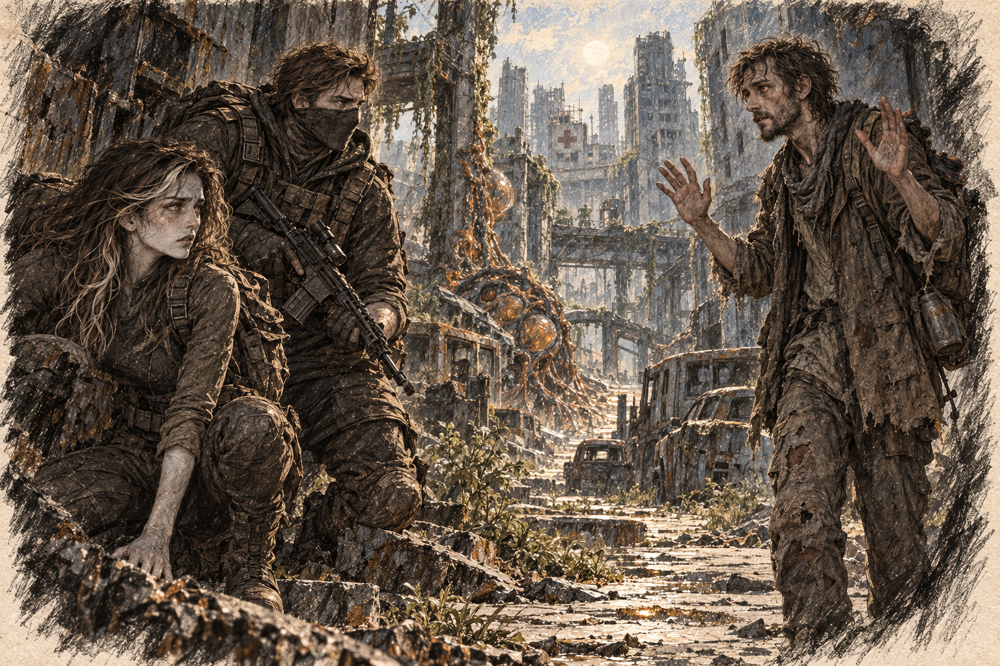

# Chapter 20: Shadows of the Past

By moonrise, Harrow was dragging one foot. Ava had counted three turns since the hospital disappeared behind the buildings. At each one, Gabriel stopped to check the map. They were covering less ground each time.

“We can’t keep going all night,” Gabriel said, his voice breaking the silence. He glanced back at Ava and Harrow, his features hard in the dim light. “We need to set up camp.”

Ava checked the vehicles nearest them. Their windows were gone, their doors hanging open. None offered a place to sleep that she could defend from more than one side.

“We need somewhere defensible,” she murmured, tightening her grip on her blade. “Mutants won’t ignore us if we’re out in the open.”

Harrow stumbled slightly, his breath coming in uneven gasps. “What about my camp?” he blurted. “It’s not far from here. We had barricades, supplies… people hiding inside. It could still be safe.”

Gabriel’s eyes narrowed. “You said something attacked your camp. How do we know it’s not crawling with mutants?”

“I don’t know,” Harrow admitted, his voice trembling. “But if there’s even a chance someone survived, we have to check. Don’t we?”

Gabriel exchanged a glance with Ava, his expression unreadable. Finally, he nodded. “Lead the way. But if it looks bad, we’re out of there. No heroics.”

The journey to Harrow’s camp took them through a maze of alleyways and side streets, each blocked passage forcing them farther from the hospital route. By the time they reached the outskirts, the night air was thick with tension. The camp had been built in the shell of an old parking garage, its entrance fortified with rusted metal sheets and wooden planks. Or at least, it had been.

The barricades were shattered, the gate hanging limply on its hinges. Inside, the dim glow of the moon revealed a scene of chaos: overturned crates, bloodstains smeared across the concrete, and the unmistakable stench of decay. Yet, the silence was unsettling—there were no mutants in sight.

Harrow froze in the entrance, his hands trembling. “No,” he whispered. “No, no, no…”

“Stay close,” Gabriel ordered, his rifle sweeping the area as he moved forward. Ava followed, her heart pounding as she stepped into the eerie silence of the ruined camp.

The group moved cautiously, their footsteps echoing off the concrete walls. Gabriel motioned for them to stop as he crouched near a bloodstained crate. “Looks recent,” he murmured. “Whatever did this might still be nearby.”

A faint noise—a shuffling, wet sound—drifted from deeper within the garage. Ava tensed, her grip tightening on her blade. Gabriel signaled for silence, his gaze fixed on the darkened corridor ahead.

They followed the sound to a recess beneath the garage ramp. People huddled behind stacked crates, their mouths and noses covered with whatever cloth they had found. An older man raised a broken pipe. When his gaze reached Ava, he lurched backward.

“Monster!” he screamed, stumbling backward. His voice echoed through the garage, drawing startled gasps from the others. A woman shrieked, pulling a child closer to her as her eyes locked on the faint amber veins visible on Ava’s cheek.

“No! She’s not—” Harrow started, his voice cracking as he raised his hands to calm them. “She and Gabriel saved me! Gabriel let me follow, and she protected me!”

The older man pointed the pipe toward Ava, trembling. “That’s no human! Look at her!”

Ava stiffened, her heart sinking at the accusation. She opened her mouth to speak, but the words caught in her throat. Gabriel stepped in front of her, his rifle lowered but his stance protective.

*Not here too.*

“Enough,” Gabriel said, his voice sharp. “She’s saved more lives than you can count. So unless you want to find out what’s really lurking out there, you’ll keep quiet and listen.”

The other survivors looked from Harrow to Gabriel. The older man kept his pipe raised.

Ava stepped back before the pipe could reach her. Gabriel touched her elbow, and she held his wrist for a moment. She wanted to leave. Instead, she made herself look beyond the man to the child crouching against the wall.

“I won’t come closer,” Ava told the child. Her voice shook. “I won’t touch you.”

She had become used to being touched without hesitation. A hand at her waist while she worked, knees sharing the space beneath a table. She had let that small circle of ease convince her that something about her had changed enough for strangers to see it too.

The pipe said otherwise. So did the child pressing into her mother. Ava had no new answer to give them. She could not bring the greenhouse here, or make them sit through every evening that had taught Gabriel to remain beside her.

She loosened her grip on his wrist. He needed the hand free. So did she.

“Lower the pipe,” she said. “You’re frightening her.”

He looked behind him. His arm dropped.

“You’re human?” the older man asked Gabriel, his voice shaky. “We… we thought everyone was gone.”

“We’re here to help,” Gabriel said, lowering his rifle slightly. “How many of you are left?”

“Just us,” the man replied, his voice trembling. “The others… they tried to fight or ran outside. They didn’t make it.”

Ava glanced over the room, her heart sinking at the desperation etched on their faces. “We need a better position. That broken gate won’t keep anything out.”

A sudden screech pierced the air, and one of the survivors flinched. Gabriel raised his rifle, tracking the shadows. A chill settled over the group as unease crept in.

“Stay quiet,” he ordered. “We hold our ground tonight.”

They moved deeper into the same garage, into a store room with one doorway and a narrow ventilation grille. Gabriel checked the air while Ava helped shift a cabinet across the entrance. The survivors carried blankets and the last dry supplies in after them.

They left a gap to watch through and hung cans on a string beyond it. Harrow coaxed a small fire into life in a metal tray beneath the open grille. Its smoke drew outward. Gabriel kept the detector beside him until the reading settled, then told the survivors they could uncover their faces.

The mother unwound a cloth from the child’s mouth and folded it carefully, saving even that inadequate thing. Ava began to understand the camp through what people kept within reach. A cup nested inside another cup. Thread wound around a broken comb. A shoe with its opening stuffed against the cold. Leaving had required deciding which fragments of a household deserved carrying.

She wondered what she would have taken from her own room. The notebook, of course. After that the picture failed her. Someone had made the decision while she could not speak, and had taken nothing.

Ava could hear claws somewhere beyond the shattered gate. Each time they stopped, she looked toward the cans.

“Get some rest,” Gabriel said, his tone softer than before. “I’ll take first watch.”

Ava hesitated, glancing at Harrow before stepping closer to Gabriel. She didn’t say anything at first, her thoughts too tangled to form words. Gabriel noticed her hesitation and, instead of speaking, he gave her a small nod and sat down beside her near the fire.

He laid his jacket beside her. She put it on, pulling her hands inside the sleeves, and watched him replace the filter in his mask. He tested the seal before returning to the doorway.

“Thank you,” she said quietly, her voice barely audible.

Gabriel glanced at her, his expression steady. “We’ll make it, Ava. One step at a time.”

Ava nodded, the weight of his presence calming her. She lay down near the fire, pulling the jacket closer as the distant sounds of the night filled her ears. Gabriel stayed close, his watchful eyes sweeping through the darkness, ensuring she could rest.
