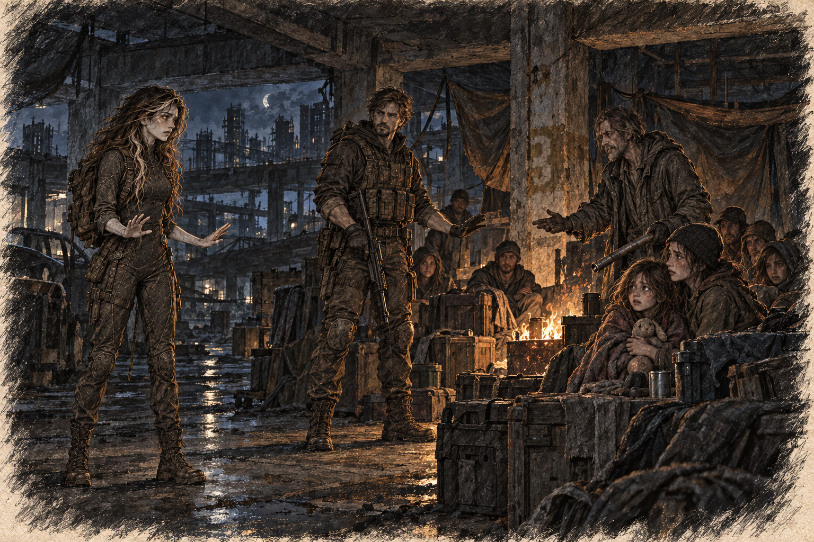

# Chapter 21: Comfort in Shadows

At dawn, Ava woke to Gabriel repeating the garage coordinates into his radio. Static interrupted him twice. Then Jenna answered: an extraction detail would reach them the following morning if the roads held.

“Keep them inside until the handoff,” Jenna said. “We’ll send scouts ahead of the vehicle.”

Ava sat up with Gabriel’s jacket still draped over her shoulders. The fire had burned low, its embers casting a soft glow across the room. Harrow was curled up in the corner, snoring faintly, while the survivors huddled together on the far side of the barricaded space.

The child beside the far wall slept with one hand around her mother’s sleeve. A tin cup lay tipped against the blanket. Ava set it upright before crossing to Gabriel.

Gabriel sat by the entrance, his rifle resting across his lap. He watched the strip of garage floor visible beyond the cabinet. He didn’t look away as Ava approached, her footsteps soft against the cracked concrete.

“You didn’t sleep,” she said, her voice hushed.

Gabriel shook his head. “Someone had to keep watch. Besides, you needed it more than I did.”

Ava sat beside him, her legs crossed beneath her. She glanced at him, noticing the tension in his shoulders and the faint shadows under his eyes. “You’re allowed to take care of yourself too, you know.”

“I said I’d take first watch.” Gabriel rubbed the bridge of his nose.

“You took all of it.” Ava held out her hand for the detector. “My turn after we eat.”

He looked ready to argue, then gave it to her.

There was a crease down one side of his face where he had rested it against the rifle sling. Ava wanted to smooth it with her thumb. In their quarters she could have done that, then drawn him down beside her until he stopped pretending he was awake. Here people needed breakfast and the space at the door needed watching.

*If we were home, I would make you lie down.*

The thought went further than sleep. She wanted the weight of him, his mouth slow at her throat, his hand under her shirt. Back in their quarters aboard the carrier, they could shut the door and be wanted where no one looked at her like a problem. Here, the child across the garage had flinched from Ava’s shadow at dusk and then pretended she had only been cold. Ava had smiled so the mother would not have to apologize. The smile still ached.

“You don’t have to earn sleep,” she said.

“Neither do you.”

She looked at him. It annoyed her that he had an answer, and more that it was a fair one. They divided the remaining food before either could turn care into another contest.

Morning light reached the dented cans beyond the cabinet. None had moved.

“Do you think they’ll trust me?” Ava asked, watching the survivors begin to wake.

Gabriel turned to look at her, his expression softening. “I don’t know,” he said. “The man with the pipe helped you move the cabinet. That’s more than he would do last night.”

“And the next time I change?” she asked. “What happens then?”

Gabriel reached out, his hand resting lightly on her arm. “Then they’ll be scared again. You don’t owe them a performance.” He nodded toward the cabinet. “They need water and a door that holds. We can work on those.”

Her throat tightened at his words, but she nodded, letting them sink in. She leaned against him slightly, drawing comfort from his steady presence. They stayed that way while morning light crept across the garage floor.

The sound of movement behind them broke the moment. Harrow shuffled over, rubbing his eyes. “Morning,” he muttered, his voice groggy.

Gabriel rose to his feet, his rifle back in hand. “Jenna’s team won’t arrive until tomorrow. We’ll secure this camp and make sure the survivors stay safe here. Then we push toward the hospital.”

Harrow hesitated, his expression torn. “I’m coming with you,” he said finally. “There’s something I need to find there.”

Gabriel raised an eyebrow but didn’t question him. “Alright. Just stay close and don’t wander off. We can’t afford to lose anyone.”

“What do you need to find?” Ava asked.

Harrow checked the survivors behind him before answering. “I’ll tell you on the way.”

She did not like that answer. For now, there were water containers to fill. She set the detector where she could see it and sent Gabriel to sleep.

The older man brought one container to the entrance and stopped just short of her hand. Ava put it down between them after filling it. He picked it up by the same handle.

*He still thinks I’ll poison him.*

“How much for each?” he asked.

“One cup now. We’ll count what’s left afterward.”

He nodded and went to distribute it. She watched him measure a little less for himself. Last night she had wanted him reduced to the man who called her a monster; it would have been easier to dislike him that way.

When he came back, she told him he could take the full cup. He did not thank her. He did take it.

Nia would not take a cup from Ava’s hand. She took it from Lila, who had lifted it from the row of cups Ava had filled. Ava let that distance stand. The girl drank without looking at her. That was enough for now.

Harrow had been watching the row. He took a grey filter cartridge from the inside pocket of his coat, turned it once, and set it beside Lila’s cup. The housing was cracked along one seam and patched with tape. “It still pulls,” he said. “Give it to the kid if the air goes bad before your people get here. Don’t waste it on me.”

Lila closed her hand over it before anyone could argue.

Harrow looked at Gabriel. “Your ship owes me a whole one. I’m not donating the last thing in my pocket out of charity. I want the replacement when the truck comes, and I want it in my hand before we leave this garage.”

Gabriel studied the cracked housing. “If Jenna’s detail has a spare, it’s yours. If they don’t, you get the next one off the carrier. I’m not promising a cartridge I haven’t seen.”

“Write it down,” Harrow said.

Gabriel did.

Ava had been ready to count the gift as another bargain. He had given the filter away before naming the price. She still did not like him. She stopped watching his hands every time he crossed the room.

By the next morning the extraction detail had the names. Tomas, water and the gate count. Lila, seam repair, and Nia with her. Harrow stood where Gabriel had told him to stand, at the ramp, checking masks without being asked to carry a weapon. Ava let him keep that job. She did not give him the research notes.
