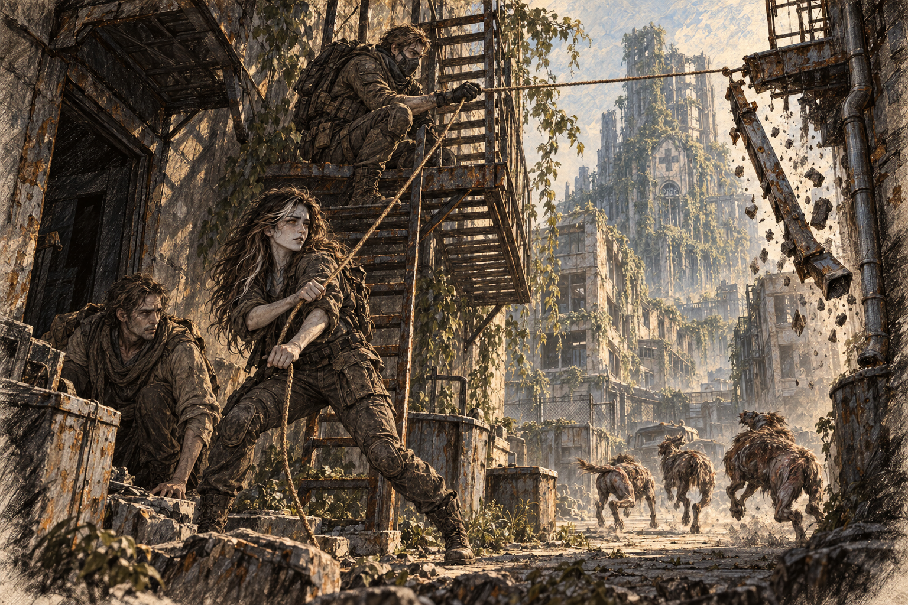

# Chapter 23: Fragile Paths

The detour took the hospital out of sight. Harrow stumbled at a broken kerb and steadied himself against Ava’s pack without asking. She stopped until he had his balance, then pointed him toward the clear pavement.

“We need to stop soon,” Gabriel said, glancing at Ava. “The light’s fading, and we can’t risk getting caught out in the open at night.”

Ava surveyed the area, her instincts sharpened by the tension in the air. “There,” she said, pointing to a partially intact office building. “It’s not ideal, but it’ll give us some cover.”

Gabriel nodded, leading the way toward the building. They entered cautiously, stepping over shattered glass and broken furniture. The air inside was stale, but it felt safer than the exposed streets.

“We’ll clear the area and secure it,” Gabriel instructed. “Harrow, stay here.”

Harrow nodded, sinking onto a dust-covered chair. “Not going anywhere,” he muttered.

Ava and Gabriel checked the office rooms one at a time. She tested each door while he covered the passage behind her. In the last room a window frame knocked against the wall; she wedged it still before giving him the all-clear.

Gabriel checked the detector in the room they had chosen. “Air’s clear too.”

She nodded, though her grip on her blade didn’t relax. “Let’s set up some alarms. We can’t afford any surprises.”

Together, they rigged a simple warning system using cans and string, draping the makeshift alarms across the entrances and stairwells. By the time they finished, the last rays of sunlight had disappeared, leaving the building cloaked in darkness.

The trio sat around a dim lantern in the center of the room they’d chosen as their base for the night. Harrow’s face was drawn, his eyes distant as he stared at the flame. Ava could see the weight of the journey wearing on him, though he remained silent.

“What did your sister work on?” Ava asked gently, breaking the quiet.

Harrow looked up, his expression shadowed. “She was trying to reverse it—the mutation. Said she found something, but she…” He trailed off, his jaw tightening. “I don’t know if she finished. I just… I need to know.”

Gabriel exchanged a glance with Ava before speaking. “We’ll do what we can. But you need to stay focused. If there’s anything left at that lab, we’ll find it.”

Jenna had sent them after reports of blood research. Ava could not yet tell whether Harrow’s story confirmed those reports or merely repeated them. She watched him rub his thumbs together beneath the lantern.

Harrow nodded, though his hands fidgeted in his lap. “Thanks. Both of you.”

When he bent over his blanket, Ava moved to the doorway with Gabriel. Shelves had been taken apart to cover the lower window; beneath the desk someone had once arranged tins to catch rain. The people who used this room before them had tried to stay. She examined the old water marks, wondering which leak had finally driven them out.

Gabriel put his folded coat beside her watch position.

“You’ll want that,” she said.

“So will you.”

She caught his sleeve before he moved away and kissed him. It was brief, awkward beside the doorframe, and made her want a great deal more than the room allowed. When he touched her cheek afterward she turned into his hand for one private second.

*More.*

The word came with enough heat that she was glad he could not hear it.

“When we get back,” she whispered, “I want our door shut.”

“It usually is.”

“Locked, Gabriel.”

Understanding reached him. “Locked.”

“Wake me,” he said.

“When it’s your turn.”

She watched him settle on the floor. A few nights ago she had learned the weight of him beside her; now the space between their blankets felt chosen by someone else. She took the coat and put it beneath her elbow, where she could feel it while watching the stairs.

Ava took the first watch. When Gabriel tried to stay beside her, she pointed him toward his blanket. He slept until she woke him for the changeover. Neither heard the cans move. At dawn they packed the lantern and took the alarms down.

Morning exposed what darkness had hidden: buckled streets, stripped towers, and vines spanning whole intersections. When the mist thinned, the hospital emerged ahead, its upper floors sagging beneath alien growth.

Ava checked the nearby paving for subsidence before trusting that this route would hold.

“Stay sharp,” Gabriel said, his voice low but firm. “We’re almost there, but that’s when things tend to go wrong.”

Ava shifted the blade to her other hand. Harrow stopped at the corner to wait for Gabriel’s signal; ahead of them, the hospital courtyard lay open to every window above it.
