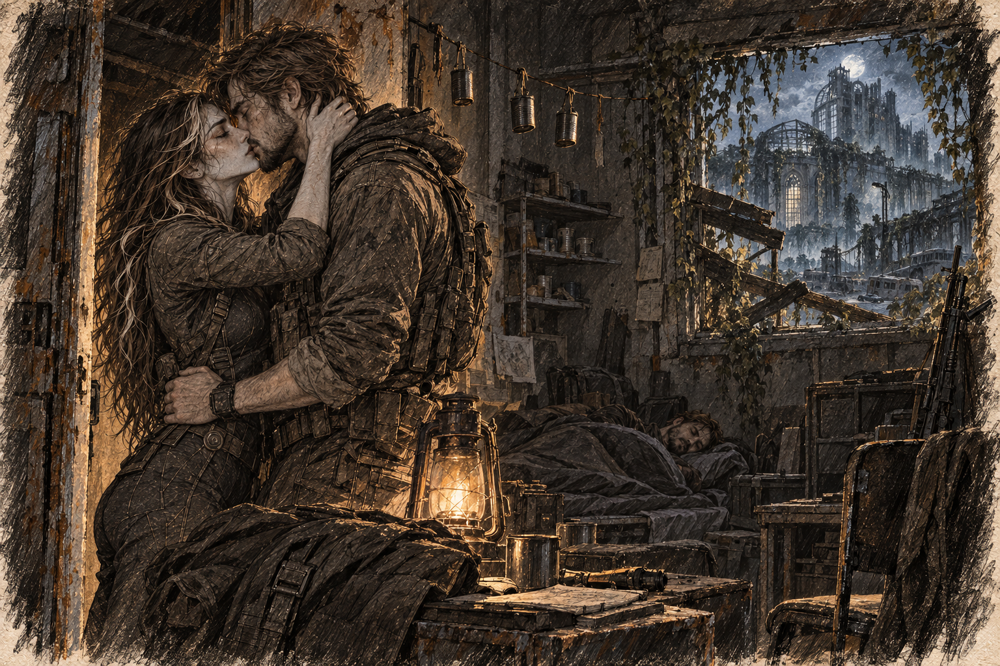

# Chapter 24: Approaching the Hospital

Gabriel halted at the edge of the hospital courtyard. A wheelchair lay on its side beside the entrance, one wheel still turning in the wind. Ava followed his line of sight upward. Growth packed the broken windows, leaving dark gaps between the leaves.

“We’re close,” he said, his voice low but resolute. “Let’s make this quick. No unnecessary risks.”

Harrow started across before Gabriel signalled. Ava caught his sleeve. He stopped, looking first at her hand, then at the entrance.

They crossed beside a line of concrete planters, using them for cover. Ava watched the growth overhead. One dead stem fell and struck the paving behind them; all three stopped until it lay still.

The trio reached the hospital’s main entrance, its doors hanging askew on rusted hinges. Gabriel stopped, signaling for silence. He peered inside, his sharp gaze sweeping over the dimly lit lobby.

“Looks clear,” he said, stepping inside. “Stay close.”

Ava followed, her blade at the ready, while Harrow lingered behind, his breaths shallow. The lobby was a scene of devastation: overturned furniture, shattered glass, and dark stains smeared across the floor. The faint scent of decay hung in the air, making Ava’s stomach turn.

Behind the reception desk, half a name remained on the wall. She tried joining the surviving letters into something she knew, remembering her promise to look. Nothing came. Someone had painted a direction arrow beneath them long after the original lettering fell: lower level, water. The newer message had outlived whoever needed it.

The desk itself unsettled her more. She could imagine standing there with her field notes ready, explaining symptoms carefully enough to avoid sounding frightened. She had trusted a place like this to know what to do with her. Even now, looking at the empty space behind it, she felt a small, senseless disappointment that nobody would come to help.

*Someone should be here.*

“We need to find the lab,” Harrow said, his voice trembling. “It’s on the lower level.”

Gabriel glanced at him, his expression unreadable. “We’ll get there. Stay focused.”

Navigating the hospital was like walking through a graveyard. Every creak of the floor and whisper of the wind seemed amplified, setting their nerves on edge. Ava kept her eyes on Harrow, watching for any sign that he might panic. He was holding up, but just barely.

“This way,” Gabriel said, pointing to a staircase leading down. The railing was bent, and the steps were littered with debris, but it seemed passable.

As they descended, the air grew colder, carrying with it a damp, metallic scent. The faint hum of generators somewhere deep in the building sent vibrations through the walls, a reminder that not all the hospital’s systems had failed.

The trio reached the lower level, the corridor stretching out before them like a yawning maw. Flickering emergency lights cast erratic shadows on the walls, making the space feel alive.

“Let’s find that lab,” Gabriel said, his voice steady. “And stay alert. This place feels wrong.”

The first few rooms they checked were empty, their contents either looted or destroyed. Harrow grew increasingly anxious, his movements quick and jerky as he sifted through the wreckage, his eyes darting from one broken fragment to the next. Ava noticed him linger over a shattered monitor, his fingers brushing against the cracked screen. “She used to work here,” he murmured, almost to himself. “This was her station.”

Gabriel stepped closer, his rifle slung but ready. “We’ll find something,” he said firmly. “Keep looking.”

In one room, Ava spotted a fragment of a notebook half-buried under debris. She carefully extracted it, flipping through its smudged pages. Rough sketches of DNA strands and notes written in a hurried hand filled the pages. “Harrow,” she called, holding up the notebook. “Does this look familiar?”

Harrow’s eyes widened as he took the notebook. “This is hers,” he said, his voice trembling. “She was close to something. I knew it.” He hesitated, then added, “These notes could be worth a fortune. People out there would pay anything for a chance at reversing the mutation. It could change everything.”

*He would sell hope by the page.*

Ava held onto the corner of the notebook. “A fortune? That’s what you see here?”

Harrow recoiled slightly. “No—I mean, yes. Look, I know how it sounds, but this could save lives too. If the right people get it, they can use it.”

“We’re not just handing this over,” Gabriel said firmly. “If you want these notes, you’re giving us a copy first. Non-negotiable.”

Harrow looked toward the exit, then down at Ava’s hand on the page. “Fine. You can have a copy. But this stays with me.”

Gabriel used his field scanner on the legible pages. Harrow turned them impatiently; Gabriel made him go back whenever a corner obscured the writing. The copied fragment ended halfway through a table. Whatever completed it was still missing.

Harrow tucked the notebook under his coat and led them down the corridor.

“Who buys things like that?” Ava asked Gabriel quietly.

“Settlements with laboratories. Traders. The Crimson Syndicate deals in medical supplies when there’s a shortage they can profit from.”

“You think he knows them?”

“I don’t know who he knows.” Gabriel watched Harrow try a door. “He wouldn’t have to know the person who eventually used the pages.”

Ava pictured the notebook changing hands while its meaning grew smaller: a method to its writer, passage north to a seller, something locked away until the price rose. She understood wanting food. She could not bear the ease with which that want might swallow everyone else’s.

Ahead, Harrow beckoned them onward. She caught up with her own hand still empty, feeling for the corner of the page she had let him take.

“It should be here,” he muttered, stopping outside a door marked ‘Research Lab 4B.’ The window in the door was cracked but intact, offering a glimpse of the chaos inside: overturned tables, shattered equipment, and papers scattered across the floor.

Gabriel tested the door, but it didn’t budge. The keypad next to it blinked faintly, its screen cracked but functional. “Looks like it’s locked,” Gabriel muttered.

Ava stepped forward, examining the keypad. “There might be a code nearby,” she said. Beside the corridor desk, a worn maintenance label carried four handwritten digits: 4512.

“Worth a shot,” she said, punching the numbers into the keypad. The lock clicked, and the door creaked open, revealing a scene of destruction. Ava stepped inside first, her blade drawn as her eyes swept the room. There were no signs of life—mutant or otherwise—but the tension in the air was palpable.

“Start looking,” Gabriel said, moving to the nearest table. “Anything that looks important, grab it. But don’t take too long.”

Harrow moved to a cabinet, his hands shaking as he rifled through its contents. Ava found folders and bound assay ledgers on a desk, their pages yellowed but intact. She flipped through them, her heart racing as she caught glimpses of diagrams and notes that hinted at genetic research. The handwriting was rushed, and several pages were marked with the word “Failed” in bold, underlined letters. She compared two dates and found a gap. A method continued on a page that was no longer in the folder. She knew the frustration of incomplete field records; these might be impossible to repeat without the missing steps.

“This could be it,” she said, holding up the folders.

Gabriel moved to her side, scanning the pages quickly. His jaw tightened as he took in the notes. “The tests failed,” he muttered, pointing to the bold, underlined letters. “They ran out of time—and something’s missing,” he added, gesturing to a scrawled note in the margin: 'Need alternative stabilizing agent.' “Let’s pack it up and move. We don’t want to linger here.”

As they worked, a faint noise reached their ears—a distant clicking sound that made the hairs on the back of Ava’s neck stand up.

“They’re here,” Gabriel said, his voice barely above a whisper. “We need to move. Now.”
