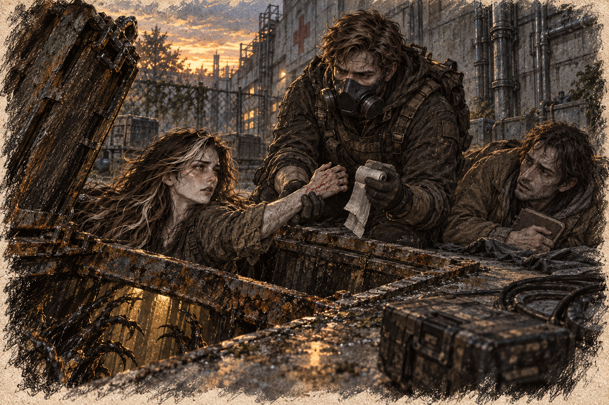

# Chapter 26: Under Pressure

Beyond the hospital’s maintenance yard, Gabriel led them along the wall until they could no longer hear claws striking the hatch. Ava kept her wrapped hand against her pack. Every step jarred the cut. Harrow followed with the notebook held beneath his coat.

“How far to the next safe zone?” Harrow asked, his voice shaky.

Gabriel didn’t look back. “None cleared on this route. Jenna’s forward team is checking the rendezvous. We meet them, then get back to the transport.”

Ava glanced at Gabriel, her jaw tightening. “Do you think they’ll make it in time?”

“I’m calling them again at the next open junction.” He checked the radio. “If they can’t get through, we need another route.”

As they pressed forward, the streets narrowed into an alleyway, its walls lined with graffiti and broken pipes. The air felt heavier here, a dampness clinging to their skin. Ava’s steps slowed, her instincts flaring.

“Something’s not right,” she said, her voice barely above a whisper.

Gabriel stopped, raising a hand to signal silence. The trio stood frozen, their breaths shallow, as a low growl rumbled from somewhere ahead.

“We need to move,” Harrow whispered, his grip tightening on the notebook.

Gabriel nodded, motioning for them to follow as he edged toward a crumbling doorway. He pushed it open cautiously, revealing a dimly lit room filled with overturned furniture and scattered debris.

“In here,” he said, stepping inside. “We’ll use this to regroup.”

The room was quiet, the only sounds the faint drip of water and their own labored breathing. Gabriel positioned himself near the entrance, his rifle trained on the dark hallway beyond. Ava crouched near Harrow, her eyes scanning the space for anything useful.

“Why do you think they failed?” Harrow asked suddenly, his voice cutting through the silence. “The notes… they said they ran out of time, but it sounded like they were close.”

Ava hesitated, her fingers brushing over the blade at her side. “Maybe they were missing something. Or maybe… they didn’t know what they were looking for.”

Gabriel’s gaze flicked toward her. “Doesn’t matter why they failed. What matters is what we do now. If those notes are even half as valuable as Harrow thinks, and with the scarce medical supplies we managed to recover, we can’t let them fall into the wrong hands.”

Harrow nodded, his face pale. “I just… I hope it’s worth it.”

Ava looked at Harrow’s notebook. She had needed Gabriel to help wrap her hand; Harrow had not once offered to carry her pack.

*Ask him. Stop waiting to be noticed.*

She had been storing each failure as another reason to distrust him while pretending the weight was nothing.

“Hold this while I adjust the strap.”

Harrow looked up. She eased the pack down between them before he could misunderstand. He took it with his free hand, the other still pressed over the notebook.

For a moment her shoulder lifted without resistance. The relief was so great she wanted to sit and leave the pack with him. Instead she tightened the fastening, took it back, and said, “Thanks.” He had done one thing she asked. She could allow that much without deciding he was safe.

A sudden noise shattered the quiet—the unmistakable clicking of a mutant echoing through the hallway. Gabriel motioned for silence, his rifle trained on the door. Ava gripped her blade tightly, her muscles coiled and ready to strike.

The door creaked open slowly, and a grotesque form stepped into view. The mutant’s twisted body moved with unnerving speed, its glowing eyes locking onto the trio. Gabriel fired when it blocked the only clear exit. Spores lifted from the wound as it fell. His detector chirped; Harrow clamped both hands over his mask seal.

“Move!” he barked, shoving Harrow toward the opposite door. Ava followed, using the flat of her blade to knock a second mutant’s reaching arm aside. Its claws scraped the doorframe as she pulled clear. Behind her, more feet struck the floor.

The trio bolted into the adjoining room, their breaths ragged as they barricaded the door with a heavy desk. Gabriel’s chest heaved as he reloaded his rifle, his eyes darting to Ava.

“You okay?” he asked, his voice tight.

She nodded, though her hands trembled slightly. “Just… tired.”

Gabriel kept looking at her.

“Don’t ask me if I’m all right,” Ava said. “Ask me how much farther. I can answer that.”

“Two rooms and an alley to the street.”

“Then I can do two rooms and an alley.”

*I can’t keep doing this.*

“We can’t stay here,” Harrow said, his voice rising in panic. “They’ll find a way in.”

Gabriel placed a hand on Harrow’s shoulder, his grip firm. “Keep it together. We’ll get through this.”

The faint sound of distant gunfire echoed from outside, drawing their attention. Gabriel’s expression hardened. “Could be the forward team.” He pressed the radio switch. “Identify. We’re south of your gunfire.”

A reply broke through the static: the call sign Jenna had given them, then a request for help at the subway entrance.

“Then let’s not waste time,” Ava said, her voice steady despite the exhaustion in her eyes.

Gabriel checked his remaining magazine before leading them toward the subway. Ava followed, counting the shots ahead. The gaps between them were getting longer.
