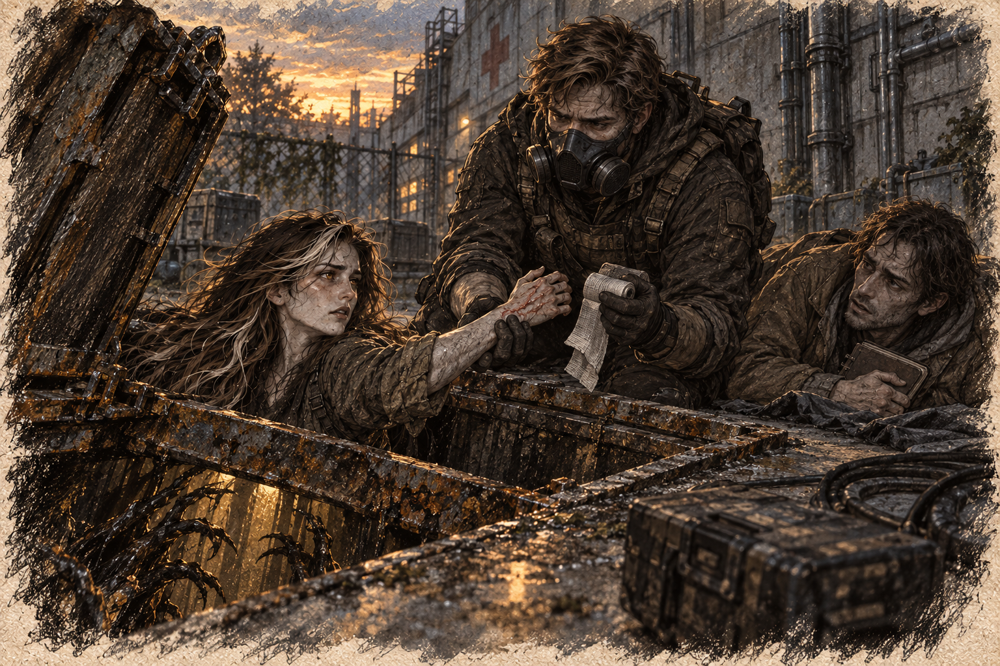

# Chapter 26: Two Rooms and an Alley

Beyond the hospital’s maintenance yard, Gabriel led them along the wall until they could no longer hear claws striking the hatch. Ava kept her wrapped hand against her pack. Every step jarred the cut. Harrow followed with the notebook held beneath his coat.

“How far to the next safe zone?” Harrow asked, his voice shaky.

Gabriel didn’t look back. “None cleared on this route. Jenna’s forward team is checking the rendezvous. We meet them, then get back to the transport.”

Ava glanced at Gabriel, her jaw tightening. “Do you think they’ll make it in time?”

“I’m calling them again at the next open junction.” He checked the radio. “If they can’t get through, we need another route.”

As they pressed forward, the streets narrowed into an alleyway, its walls lined with graffiti and broken pipes. The air felt heavier here, a dampness clinging to their skin. Ava’s steps slowed, her instincts flaring.

“Something’s not right,” she said, her voice barely above a whisper.

Gabriel stopped, raising a hand to signal silence. The trio stood frozen, their breaths shallow, as a low growl rumbled from somewhere ahead.

“We need to move,” Harrow whispered, his grip tightening on the notebook.

Gabriel nodded, motioning for them to follow as he edged toward a crumbling doorway. He pushed it open cautiously, revealing a dimly lit room filled with overturned furniture and scattered debris.

“In here,” he said, stepping inside. “We’ll use this to regroup.”

The room was quiet, the only sounds the faint drip of water and their own labored breathing. Gabriel positioned himself near the entrance, his rifle trained on the dark hallway beyond. Ava crouched near Harrow, her eyes scanning the space for anything useful.

“Why do you think they failed?” Harrow asked suddenly, his voice cutting through the silence. “The notes… they said they ran out of time, but it sounded like they were close.”

Ava hesitated, her fingers brushing over the blade at her side. “Maybe they were missing something. Or maybe… they didn’t know what they were looking for.”

Gabriel’s gaze flicked toward her. “Doesn’t matter why they failed. What matters is what we do now. If those notes are even half as valuable as Harrow thinks, and with the scarce medical supplies we managed to recover, we can’t let them fall into the wrong hands.”

Harrow nodded, his face pale. “I just… I hope it’s worth it.”

Ava looked at Harrow’s notebook. She had needed Gabriel to help wrap her hand. Blood had soaked through the gauze again, and the pack strap sawed at the same wrist.

Harrow saw it. He did not wait to be asked. He took the research pack off her shoulder, settled the cut strap over his own, and re-rigged the broken buckle with a strip of wire from his pocket. “I can carry it through the next two rooms,” he said. “Your hand’s useless on that buckle. Don’t thank me until you see I didn’t open it.”

The relief made her angry. She wanted to take the pack back out of spite and could not close her fingers well enough to do it.

They left the doorway when the radio coughed a partial grid from Jenna’s forward team. Gabriel held the handset to his ear and repeated the only words that survived the static: alley, then west, then a count of minutes before the team moved. Distant gunfire answered him, already thinner than it had been at the hospital wall.

“If we take the alley, we reach them,” he said. “If we wait for a cleaner signal, they may be gone. Two rooms and an alley. That’s the decision.”

“Then we take it,” Ava said.

*I can’t keep doing this.*

Harrow went first with the pack, head down, choosing the footing where the alley had collapsed into rebar. A pipe scraped his mask. He stopped, resealed it with his thumb, and checked Ava’s before he moved again. At the far door he set the pack in her reach and opened the flap where she could see it.

“Count them,” he said.

The folders were there. The scanner was there. Nothing in the pack had moved into his coat.

Ava and Gabriel both looked at the open flap, then at him. Gabriel took the pack back himself. “You had the records,” he said. “You gave them back.”

Harrow shrugged, already reaching for his own notebook. “I said two rooms. I’m not your saint.”

Ava stopped watching his hands. The trust was small and specific, and she felt it anyway. Gabriel, later, at the outpost, gave Harrow the lamp and the door count and nothing else. One job. Not the cases.

The faint sound of distant gunfire echoed from outside, drawing their attention. Gabriel’s expression hardened. “Could be the forward team.” He pressed the radio switch. “Identify. We’re south of your gunfire.”

A reply broke through the static: the call sign Jenna had given them, then a request for help at the subway entrance.

“Then let’s not waste time,” Ava said, her voice steady despite the exhaustion in her eyes.

Gabriel checked his remaining magazine before leading them toward the subway. Ava followed, counting the shots ahead. The gaps between them were getting longer.
