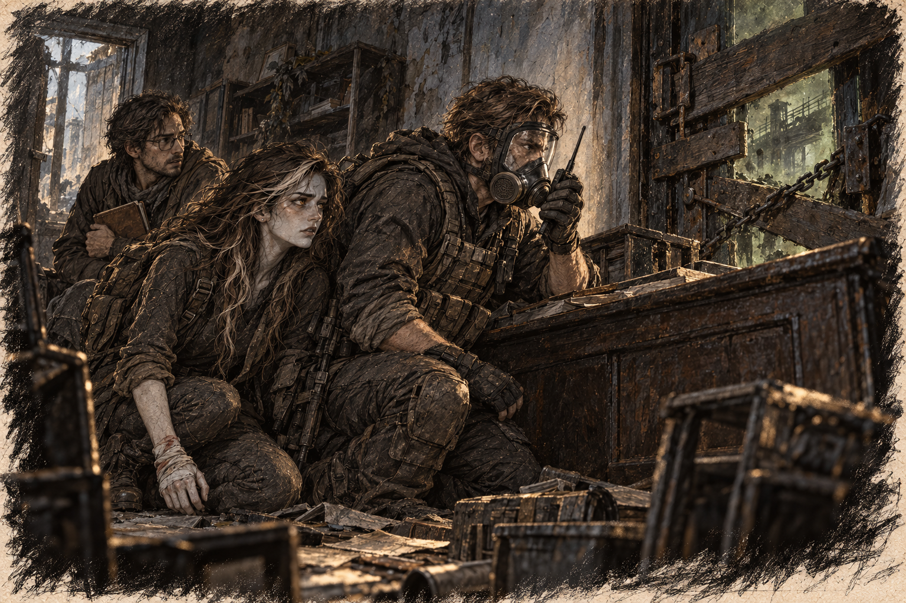

# Chapter 27: The Fight to Survive

Ava heard a burst of gunfire, a pause, then three separate shots. Gabriel hurried toward the subway entrance with his rifle raised. Harrow stayed behind Ava, close enough to strike her pack whenever she stopped.

“That’s Jenna’s forward team,” Gabriel said, glancing over his shoulder. His voice was calm, but Ava could sense the tension beneath it. “Stay close. If they’re in trouble, we’ll need to help.”

The trio picked up their pace, weaving through the wreckage of abandoned streets. The gunfire grew louder, accompanied by guttural screeches and the unmistakable clicking of mutants. Ava’s heart pounded as they rounded a corner and spotted the firefight ahead.

The forward team was pinned against the wall of an old subway entrance. Behind them, a handful of civilians crouched on the stairs. They must have found more people while checking the route. A crew member held a spare mask against an injured man’s face as the others fired at the advancing mutants. The creatures moved with terrifying speed, their grotesque forms illuminated by the muzzle flashes of the team’s weapons.

Gabriel didn’t hesitate. “Ava, flank them on the right. Harrow, stay behind cover. I’ll take the left.”

Ava nodded, her grip tightening on her blade as she moved swiftly along the edge of the battle. Gabriel opened fire, the sharp cracks of his rifle cutting through the chaos. One mutant collapsed mid-lunge. Spores rose from its torn chest and drifted across the steps. Gabriel shouted a seal check over the radio; Ava heard the team answer one by one.

At the right flank, Ava pulled back the soaked dressing and pressed fresh blood along her blade. The older coating had dried uselessly against the metal. Her stomach rolled when the cut opened again. She had to get close before the new blood lost its strength.

A mutant lunged toward the crew member holding the mask. Ava struck across its side, driving the wet edge into tissue. It collapsed against the steps without adding to the spore cloud.

The soldier she saved gave her a wide-eyed nod of thanks before turning back to the fight. Ava paused for a moment, her breath unsteady, before pushing herself to refocus. She reset her feet as Gabriel had taught her. The next creature was already coming.

Gabriel’s voice rang out over the din. “Jenna! What’s your status?”

One of the transport team’s leaders shouted over the chaos, their voice breathless but steady. “Low on ammo and down two men. We need to fall back!”

“Cover us!” Gabriel shouted, motioning for Ava to regroup. She sprinted back, her breath coming in sharp bursts as mutants closed in on the team’s position.

“Go! I’ll hold them!” Gabriel fired at the nearest creature blocking the retreat. Ava hesitated, but the forward-team leader caught her sleeve and pointed toward the injured civilians.

“Gabriel, no!”

He did not look back. “Move them!”

*Don’t leave him. Don’t you dare leave him.*

“Help me move them.” The leader released her sleeve. “That side.”

Gabriel was still firing. Ava wanted to turn toward him so badly that the injured civilian became, for one shameful instant, a weight keeping her from the person she loved.

The man tried to stand without her and nearly fell. She caught him beneath the arm. He was frightened too; she could hear him trying to apologize for how slowly his feet moved. She told him where to put the next one. Gabriel had given her the same kind of instruction when she could manage nothing larger.

Ava put a civilian’s arm over her shoulder and followed the retreating team, forcing a reaching claw aside with her blade. They scrambled down a side alley, the sound of Gabriel’s gunfire echoing behind them. When they reached a defensible position, Ava turned back, her heart in her throat.

Gabriel appeared moments later, his rifle smoking as he backed into the alley. “Let’s move!” he ordered, his voice sharp with urgency.

“You bastard,” Ava said, half a sob beneath the words. Then she seized the injured man’s arm again.

The team regrouped in an old maintenance tunnel, their breaths heavy and weapons low on ammunition. Over the crackling radio, Jenna’s voice was steady but laced with urgency as she addressed her team. “Status report. How many made it?” Though they couldn’t see her, the weight of exhaustion and determination was evident in her tone.

“Thanks for the assist,” one of the transport team members said to Gabriel and Ava. “We wouldn’t have made it without you.”

Gabriel nodded, his expression unreadable. “We’re not safe yet. How’s your ammo?”

“Running dry,” the team leader said.

Jenna answered over the radio. “The factory refuge is closest. Check it before you bring anyone inside. Main transport has the garage group and is holding at the railway station.”

Ava glanced at the team, her gaze settling on a young soldier clutching a bandaged arm. “We can’t keep fighting like this,” she said quietly. “We need a plan.”

The transport team leader nodded. “We fall back to the safe zone. It’s not far from here. We’ll signal for extraction and hold out until reinforcements arrive.”

Gabriel exchanged a glance with Ava, his jaw tight. “Then let’s move. Stay sharp, and stay close.”

Ava helped retighten the injured man’s mask before they left. He could walk if someone kept an arm around him. She passed her research pack to Gabriel and took the man’s weight.

The man tried to keep his damaged side away from her. When she told him to lean, he did, with an abrupt trust that frightened her more than his hesitation. He could not know how tired her hand had become.

She asked the team leader to watch them on the turns. Then she shortened her stride until his feet could follow. Gabriel’s back remained visible ahead, moving each time she looked up.
